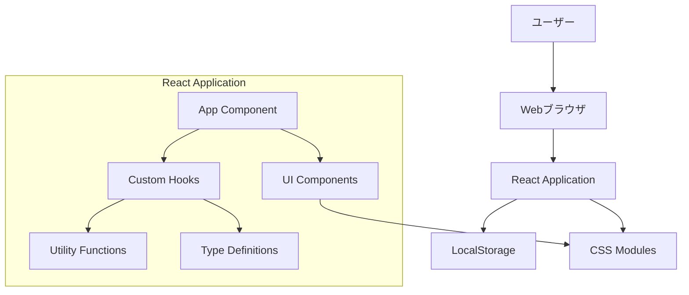

# 設計文書

## 概要

この設計文書は、Claude Code初心者ガイドに沿ったsimple-webappサンプルの完全な実装を定義します。React + TypeScriptを使用したユーザー管理システムを構築し、開発者がClaude Codeを効果的に活用する方法を学習できる包括的な例を提供します。

## アーキテクチャ

### システム全体構成



### 技術スタック

- **フロントエンド**: React 18 + TypeScript 4.9+
- **ビルドツール**: Vite 4.x
- **スタイリング**: CSS Modules
- **状態管理**: React Hooks (useState, useEffect, useCallback, useMemo)
- **データ永続化**: Browser LocalStorage API
- **開発ツール**: ESLint, Prettier, TypeScript Compiler

### アーキテクチャパターン

- **コンポーネント設計**: 単一責任の原則に基づく機能別分割
- **状態管理**: カスタムフックによる状態ロジックの分離
- **データフロー**: 単方向データフロー（React標準）
- **エラーハンドリング**: 各層での適切なエラー処理

## コンポーネントとインターフェース

### コンポーネント階層

```
App
├── UserManagementApp
    ├── UserForm (ユーザー追加フォーム)
    ├── SearchBar (検索機能)
    ├── UserList (ユーザー一覧)
    │   └── UserCard (個別ユーザー表示)
    └── UserStats (統計情報表示)
```

### 主要コンポーネント仕様

#### UserManagementApp
- **責任**: アプリケーション全体の状態管理と子コンポーネントの統合
- **Props**: なし
- **State**: ユーザーリスト、検索クエリ、フィルター状態
- **Hooks**: useUsers (カスタムフック)

#### UserForm
- **責任**: 新規ユーザーの追加とバリデーション
- **Props**: onAddUser: (user: CreateUserInput) => void
- **State**: フォーム入力値、バリデーションエラー
- **機能**: リアルタイムバリデーション、送信処理

#### UserCard
- **責任**: 個別ユーザー情報の表示と操作
- **Props**: user: User, onEdit: (id: string) => void, onDelete: (id: string) => void
- **State**: 編集モード状態
- **機能**: インライン編集、削除確認

#### SearchBar
- **責任**: ユーザー検索とフィルタリング
- **Props**: onSearch: (query: string) => void, placeholder?: string
- **State**: 検索入力値
- **機能**: リアルタイム検索、検索結果ハイライト

### カスタムフック設計

#### useUsers
```typescript
interface UseUsersReturn {
  users: User[];
  filteredUsers: User[];
  searchQuery: string;
  isLoading: boolean;
  error: string | null;
  
  // CRUD操作
  addUser: (input: CreateUserInput) => Promise<void>;
  updateUser: (id: string, input: UpdateUserInput) => Promise<void>;
  deleteUser: (id: string) => Promise<void>;
  
  // 検索・フィルタリング
  setSearchQuery: (query: string) => void;
  clearSearch: () => void;
  
  // ユーティリティ
  getUserById: (id: string) => User | undefined;
  getUserCount: () => number;
}
```

#### useLocalStorage
```typescript
interface UseLocalStorageReturn<T> {
  value: T;
  setValue: (value: T | ((prev: T) => T)) => void;
  removeValue: () => void;
  isLoading: boolean;
  error: string | null;
}
```

## データモデル

### 型定義

```typescript
// 基本ユーザー型
interface User {
  id: string;
  name: string;
  email: string;
  createdAt: Date;
  updatedAt: Date;
}

// ユーザー作成入力型
interface CreateUserInput {
  name: string;
  email: string;
}

// ユーザー更新入力型
interface UpdateUserInput {
  name?: string;
  email?: string;
}

// バリデーションエラー型
interface ValidationError {
  field: string;
  message: string;
}

// アプリケーション状態型
interface AppState {
  users: User[];
  searchQuery: string;
  isLoading: boolean;
  error: string | null;
}
```

### データバリデーション

#### ユーザー入力バリデーション
- **名前**: 必須、1-50文字、特殊文字制限
- **メールアドレス**: 必須、有効なメール形式、重複チェック

#### データ整合性
- **ID**: UUID v4形式での一意性保証
- **日時**: ISO 8601形式での統一
- **文字エンコーディング**: UTF-8対応

### LocalStorage設計

#### データ構造
```typescript
interface StorageData {
  users: User[];
  version: string;
  lastUpdated: string;
}
```

#### ストレージキー
- `userManagementApp_users`: ユーザーデータ
- `userManagementApp_settings`: アプリケーション設定

## エラーハンドリング

### エラー分類

#### 1. バリデーションエラー
- **発生場所**: フォーム入力時
- **処理方法**: フィールド単位でのエラー表示
- **ユーザー体験**: リアルタイムフィードバック

#### 2. ストレージエラー
- **発生場所**: LocalStorage操作時
- **処理方法**: フォールバック処理とユーザー通知
- **復旧方法**: データの再読み込み、初期化オプション

#### 3. システムエラー
- **発生場所**: 予期しない例外
- **処理方法**: エラーバウンダリでのキャッチ
- **ユーザー体験**: 適切なエラーメッセージと復旧手順

### エラー処理戦略

```typescript
// エラーハンドリングパターン
const handleAsyncOperation = async (operation: () => Promise<void>) => {
  try {
    setIsLoading(true);
    setError(null);
    await operation();
  } catch (error) {
    const errorMessage = error instanceof Error 
      ? error.message 
      : '予期しないエラーが発生しました';
    setError(errorMessage);
    console.error('Operation failed:', error);
  } finally {
    setIsLoading(false);
  }
};
```

## テスト戦略

### テストレベル

#### 1. ユニットテスト
- **対象**: 個別関数、カスタムフック
- **ツール**: Jest, React Testing Library
- **カバレッジ**: 90%以上

#### 2. コンポーネントテスト
- **対象**: 個別コンポーネントの動作
- **テスト内容**: レンダリング、イベント処理、状態変更

#### 3. 統合テスト
- **対象**: コンポーネント間の連携
- **テスト内容**: データフロー、状態同期

#### 4. E2Eテスト
- **対象**: ユーザーシナリオ全体
- **ツール**: Playwright または Cypress

### テストケース例

```typescript
// UserCard コンポーネントのテスト例
describe('UserCard', () => {
  it('ユーザー情報を正しく表示する', () => {
    // テスト実装
  });
  
  it('編集ボタンクリックで編集モードになる', () => {
    // テスト実装
  });
  
  it('削除ボタンクリックで確認ダイアログが表示される', () => {
    // テスト実装
  });
});
```

## パフォーマンス最適化

### 最適化戦略

#### 1. レンダリング最適化
- **React.memo**: 不要な再レンダリング防止
- **useCallback**: 関数の再生成防止
- **useMemo**: 計算結果のメモ化

#### 2. バンドルサイズ最適化
- **Tree Shaking**: 未使用コードの除去
- **Code Splitting**: 必要に応じた動的読み込み
- **依存関係の最小化**: 軽量ライブラリの選択

#### 3. ユーザー体験最適化
- **ローディング状態**: 適切なローディングインジケーター
- **楽観的更新**: UI の即座な反映
- **エラー回復**: 自動リトライ機能

### パフォーマンス指標

- **初回読み込み時間**: < 2秒
- **操作レスポンス時間**: < 100ms
- **バンドルサイズ**: < 500KB (gzip圧縮後)

## セキュリティ考慮事項

### クライアントサイドセキュリティ

#### 1. XSS対策
- **入力サニタイゼーション**: ユーザー入力の適切なエスケープ
- **Content Security Policy**: 適切なCSPヘッダー設定

#### 2. データ保護
- **LocalStorage**: 機密情報の保存回避
- **入力バリデーション**: クライアント・サーバー両側での検証

#### 3. 依存関係セキュリティ
- **脆弱性スキャン**: npm audit の定期実行
- **依存関係更新**: セキュリティパッチの適用

## アクセシビリティ

### WCAG 2.1 準拠

#### レベルAA対応
- **キーボードナビゲーション**: 全機能のキーボード操作対応
- **スクリーンリーダー**: 適切なARIAラベル設定
- **色彩コントラスト**: 4.5:1以上のコントラスト比

#### 実装例
```typescript
// アクセシブルなボタンコンポーネント
<button
  aria-label={`${user.name}を削除`}
  onClick={handleDelete}
  className={styles.deleteButton}
>
  削除
</button>
```

## 国際化対応

### 多言語サポート設計

#### 1. テキスト外部化
- **メッセージファイル**: JSON形式での管理
- **動的読み込み**: 言語切り替え対応

#### 2. 日付・数値フォーマット
- **Intl API**: ブラウザ標準APIの活用
- **ロケール対応**: 地域固有の表示形式

## デプロイメント戦略

### ビルドプロセス

#### 1. 開発環境
```bash
npm run dev    # 開発サーバー起動
npm run test   # テスト実行
npm run lint   # コード品質チェック
```

#### 2. 本番環境
```bash
npm run build  # 本番用ビルド
npm run preview # ビルド結果プレビュー
```

### デプロイメント先

#### 静的ホスティング
- **Vercel**: 自動デプロイ、プレビュー機能
- **Netlify**: フォーム処理、CDN最適化
- **GitHub Pages**: 無料ホスティング

#### 設定例（Vercel）
```json
{
  "buildCommand": "npm run build",
  "outputDirectory": "dist",
  "installCommand": "npm install"
}
```

## 監視とメンテナンス

### エラー監視
- **クライアントエラー**: ブラウザコンソールログ
- **パフォーマンス**: Web Vitals指標
- **ユーザー行動**: 基本的な使用統計

### メンテナンス計画
- **依存関係更新**: 月次での更新確認
- **セキュリティパッチ**: 即座の適用
- **機能追加**: ユーザーフィードバックに基づく改善

## エラーハンドリング強化設計

### エラーバウンダリアーキテクチャ

#### 1. 階層的エラーハンドリング
```typescript
// グローバルエラーバウンダリ
<GlobalErrorBoundary>
  <App>
    <ComponentErrorBoundary>
      <UserManagementApp />
    </ComponentErrorBoundary>
  </App>
</GlobalErrorBoundary>
```

#### 2. エラー分類と対応
- **開発環境**: 詳細なエラー情報とスタックトレース表示
- **本番環境**: ユーザーフレンドリーなメッセージと復旧オプション
- **ネットワークエラー**: 自動リトライ機能
- **データ破損**: フォールバック処理とデータ復旧

#### 3. デバッグ支援機能
```typescript
interface DebugInfo {
  timestamp: Date;
  userAgent: string;
  url: string;
  userId?: string;
  componentStack: string;
  errorBoundary: string;
}
```

## テスト戦略強化

### 包括的テストピラミッド

#### 1. ユニットテスト（90%+ カバレッジ）
- **コンポーネント**: 各コンポーネントの独立テスト
- **フック**: カスタムフックの動作テスト
- **ユーティリティ**: 純粋関数のテスト
- **型安全性**: TypeScriptコンパイルテスト

#### 2. 統合テスト
- **データフロー**: コンポーネント間の連携テスト
- **状態管理**: 複雑な状態変更のテスト
- **LocalStorage**: データ永続化のテスト

#### 3. E2Eテスト（Playwright）
```typescript
// 主要ユーザーシナリオ
test('ユーザー管理フロー', async ({ page }) => {
  // ユーザー追加 → 検索 → 編集 → 削除
});

test('エラー回復フロー', async ({ page }) => {
  // エラー発生 → エラー表示 → 復旧
});
```

#### 4. アクセシビリティテスト
- **axe-core**: 自動アクセシビリティ監査
- **キーボードナビゲーション**: 全機能のキーボード操作テスト
- **スクリーンリーダー**: NVDA/JAWSでの動作確認

#### 5. パフォーマンステスト
- **Core Web Vitals**: LCP, FID, CLS測定
- **Lighthouse CI**: 継続的パフォーマンス監視
- **バンドルサイズ**: サイズ制限とアラート

## 学習体験設計

### 段階的学習パス

#### Phase 1: 基礎理解（30分）
1. **プロジェクト構造の理解**
   - ディレクトリ構成の説明
   - 各ファイルの役割
   - 依存関係の理解

2. **TypeScript基礎**
   - 型定義の読み方
   - インターフェースの活用
   - 型安全性の利点

#### Phase 2: コンポーネント開発（60分）
1. **基本コンポーネント作成**
   - UserCard の実装
   - Props設計
   - CSS Modules活用

2. **状態管理**
   - useState の活用
   - useEffect の理解
   - カスタムフック作成

#### Phase 3: 高度な機能（90分）
1. **データ管理**
   - LocalStorage連携
   - CRUD操作実装
   - エラーハンドリング

2. **ユーザー体験向上**
   - 検索・フィルタリング
   - ローディング状態
   - アクセシビリティ対応

### Claude Codeプロンプト集

#### 1. コンポーネント作成プロンプト
```
React + TypeScriptでUserCardコンポーネントを作成してください。
以下の要件を満たしてください：
- ユーザー情報（名前、メール）を表示
- 編集・削除ボタンを含む
- CSS Modulesでスタイリング
- アクセシビリティ対応
```

#### 2. カスタムフック作成プロンプト
```
LocalStorageと連携するuseUsersカスタムフックを作成してください。
以下の機能を含めてください：
- CRUD操作（追加、更新、削除）
- 検索・フィルタリング
- エラーハンドリング
- TypeScript型安全性
```

#### 3. テスト作成プロンプト
```
UserCardコンポーネントのテストを作成してください。
React Testing Libraryを使用して：
- レンダリングテスト
- ユーザーインタラクションテスト
- エラー状態のテスト
- アクセシビリティテスト
```

### トラブルシューティングガイド

#### よくある問題と解決策

1. **白い画面が表示される**
   - 原因: JavaScriptエラー、インポートエラー
   - 解決: ブラウザ開発者ツールでエラー確認
   - 対策: エラーバウンダリの実装

2. **TypeScriptエラー**
   - 原因: 型定義の不整合
   - 解決: 型定義ファイルの確認と修正
   - 対策: 段階的型付けの採用

3. **パフォーマンス問題**
   - 原因: 不要な再レンダリング
   - 解決: React.memo、useCallback活用
   - 対策: パフォーマンス監視の実装

4. **アクセシビリティ問題**
   - 原因: ARIA属性の不足
   - 解決: セマンティックHTMLの使用
   - 対策: 自動テストの導入

## 品質保証システム

### 継続的品質監視

#### 1. 自動化されたチェック
```yaml
# GitHub Actions例
- name: Quality Checks
  run: |
    npm run type-check
    npm run lint
    npm run test:coverage
    npm run test:e2e
    npm run lighthouse
```

#### 2. 品質メトリクス
- **コードカバレッジ**: 90%以上
- **TypeScript厳密性**: strict mode有効
- **アクセシビリティスコア**: 95点以上
- **パフォーマンススコア**: 90点以上

#### 3. レビューチェックリスト
- [ ] TypeScript型安全性確認
- [ ] アクセシビリティ準拠確認
- [ ] パフォーマンス影響確認
- [ ] テストカバレッジ確認
- [ ] エラーハンドリング確認

## 拡張性設計

### 将来の機能拡張

#### 1. バックエンド連携
- **REST API**: サーバーサイドデータ管理
- **認証機能**: ユーザーログイン・権限管理
- **リアルタイム更新**: WebSocket対応

#### 2. 高度な機能
- **データエクスポート**: CSV、JSON形式
- **一括操作**: 複数ユーザーの同時処理
- **検索機能強化**: 高度なフィルタリング

#### 3. UI/UX改善
- **ダークモード**: テーマ切り替え機能
- **カスタマイズ**: ユーザー設定保存
- **アニメーション**: スムーズな画面遷移