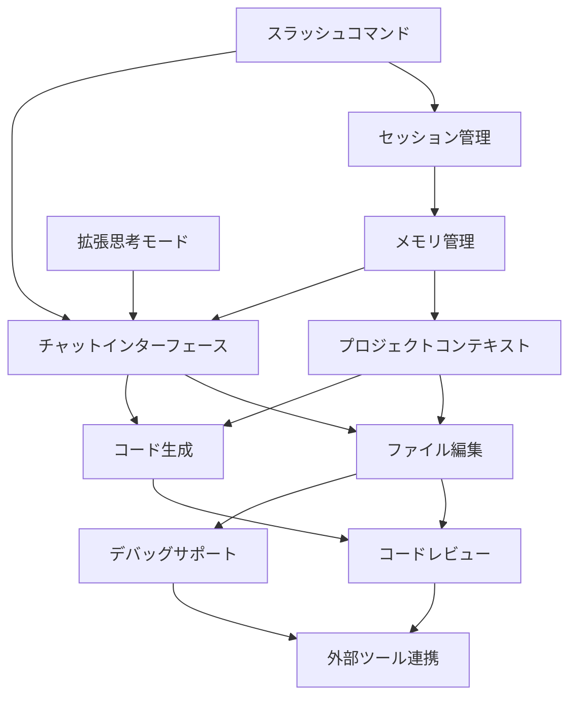

# Claude Code 機能概要

Claude Codeの主要機能について説明します。各機能の概要と学習順序を理解することで、効率的にClaude Codeを習得できます。

## 主要機能一覧

### 1. チャットインターフェース
自然言語での対話を通じてコードを生成・編集する基本機能です。

**主な特徴:**
- 日本語・英語での自然な対話
- 複雑な要件の段階的な整理
- コードの説明と解説の提供

**学習優先度:** ⭐⭐⭐ (最重要)

**詳細:** [チャットインターフェース](chat-interface.md)

### 2. コード生成
新しいコードを自動生成する機能です。

**主な特徴:**
- 多言語・多フレームワーク対応
- ベストプラクティスに従った生成
- カスタマイズ可能な生成パターン

**学習優先度:** ⭐⭐⭐ (最重要)

**詳細:** [コード生成](code-generation.md)

### 3. ファイル編集
既存のコードを理解して適切に編集する機能です。

**主な特徴:**
- 既存コードの文脈理解
- 安全なリファクタリング
- 段階的な改善提案

**学習優先度:** ⭐⭐⭐ (最重要)

**詳細:** [ファイル編集](file-editing.md)

### 4. プロジェクトコンテキスト理解
プロジェクト全体の構造と関係性を理解する機能です。

**主な特徴:**
- 複数ファイル間の依存関係理解
- アーキテクチャパターンの認識
- 一貫性のある編集

**学習優先度:** ⭐⭐ (重要)

**詳細:** [プロジェクトコンテキスト](project-context.md)

### 5. デバッグサポート
エラーの分析と修正提案を行う機能です。

**主な特徴:**
- エラーメッセージの解析
- 根本原因の特定
- 修正方法の提案

**学習優先度:** ⭐⭐ (重要)

**詳細:** [デバッグサポート](debugging-support.md)

### 6. コードレビュー
コードの品質チェックと改善提案を行う機能です。

**主な特徴:**
- 自動的な品質チェック
- セキュリティ脆弱性の検出
- パフォーマンス改善提案

**学習優先度:** ⭐⭐ (重要)

**詳細:** [コードレビュー](code-review.md)

### 7. 外部ツール連携
Git、テストツール、デプロイツールとの連携機能です。

**主な特徴:**
- Gitワークフローの自動化
- CI/CDパイプラインの構築
- テスト自動化の支援

**学習優先度:** ⭐ (応用)

**詳細:** [外部ツール連携](integration-tools.md)

### 8. メモリ管理機能
プロジェクト固有の知識やコーディング規約を記憶する階層型メモリシステムです。

**主な特徴:**
- CLAUDE.mdファイルによるプロジェクト情報管理
- 階層型メモリ（エンタープライズ/プロジェクト/ユーザー）
- メモリインポート機能（@記法）
- クイックメモリ追加（#コマンド）

**学習優先度:** ⭐⭐⭐ (最重要)

**詳細:** [メモリ管理機能](memory-management.md)

### 9. スラッシュコマンド
効率的な操作のためのコマンドラインインターフェースです。

**主な特徴:**
- /memory, /init, /helpなどの便利なコマンド
- ファイル操作とプロジェクト管理
- セッション制御とコンテキスト管理

**学習優先度:** ⭐⭐ (重要)

**詳細:** [スラッシュコマンド](slash-commands.md)

### 10. 拡張思考モード
複雑な問題に対して深い分析を行う特別なモードです。

**主な特徴:**
- --thinkフラグによる詳細分析
- 多角的な視点からの検討
- トレードオフの明確化

**学習優先度:** ⭐⭐ (重要)

**詳細:** [拡張思考モード](extended-thinking.md)

### 11. セッション管理
作業の継続性を保つためのセッション保存・再開機能です。

**主な特徴:**
- --resumeによるセッション再開
- 自動保存機能
- セッションの共有とエクスポート

**学習優先度:** ⭐⭐ (重要)

**詳細:** [セッション管理](session-management.md)

## 機能間の関係性

### 機能の依存関係

1. **基礎機能**: チャットインターフェース、メモリ管理
2. **核心機能**: コード生成、ファイル編集
3. **支援機能**: プロジェクトコンテキスト理解、スラッシュコマンド
4. **品質機能**: デバッグサポート、コードレビュー
5. **高度機能**: 拡張思考モード、セッション管理
6. **統合機能**: 外部ツール連携

## 推奨学習順序

### 初心者向け学習パス

#### ステップ1: 基本操作の習得
1. [チャットインターフェース](chat-interface.md) - 対話の基本
2. [メモリ管理機能](memory-management.md) - プロジェクト情報の記憶
3. [スラッシュコマンド](slash-commands.md) - 効率的な操作

#### ステップ2: コード作成と編集
4. [コード生成](code-generation.md) - 新規コード作成
5. [ファイル編集](file-editing.md) - 既存コード修正
6. [プロジェクトコンテキスト](project-context.md) - 大規模プロジェクト対応

#### ステップ3: 品質向上と高度な活用
7. [デバッグサポート](debugging-support.md) - 問題解決
8. [コードレビュー](code-review.md) - 品質管理
9. [拡張思考モード](extended-thinking.md) - 複雑な問題への対応
10. [セッション管理](session-management.md) - 作業の継続性
11. [外部ツール連携](integration-tools.md) - ワークフロー統合

### 中級者向け学習パス

すでに基本的なプログラミング経験がある場合：

1. [メモリ管理機能](memory-management.md) - プロジェクト設定の最適化
2. [スラッシュコマンド](slash-commands.md) - 高速操作の習得
3. [プロジェクトコンテキスト](project-context.md) - 全体理解
4. [拡張思考モード](extended-thinking.md) - アーキテクチャ設計
5. [ファイル編集](file-editing.md) - 高度な編集技術
6. [コードレビュー](code-review.md) - 品質向上
7. [セッション管理](session-management.md) - 効率的なワークフロー
8. [外部ツール連携](integration-tools.md) - 開発フロー統合

## 機能別の適用場面

### 新規プロジェクト開発
- **チャットインターフェース**: 要件の整理
- **コード生成**: 基本構造の作成
- **プロジェクトコンテキスト**: 一貫性の維持

### 既存プロジェクトの改善
- **ファイル編集**: 機能追加・修正
- **デバッグサポート**: 問題の解決
- **コードレビュー**: 品質向上

### チーム開発
- **プロジェクトコンテキスト**: 共通理解の促進
- **コードレビュー**: 品質基準の統一
- **外部ツール連携**: ワークフローの標準化

## 各機能の習得目安時間

| 機能 | 基本習得 | 実践活用 | 上級活用 |
|------|----------|----------|----------|
| チャットインターフェース | 30分 | 2時間 | 1日 |
| メモリ管理機能 | 30分 | 2時間 | 1日 |
| スラッシュコマンド | 1時間 | 3時間 | 1日 |
| コード生成 | 1時間 | 4時間 | 2日 |
| ファイル編集 | 1時間 | 4時間 | 2日 |
| プロジェクトコンテキスト | 2時間 | 1日 | 3日 |
| デバッグサポート | 1時間 | 3時間 | 1日 |
| コードレビュー | 1時間 | 3時間 | 1日 |
| 拡張思考モード | 30分 | 2時間 | 1日 |
| セッション管理 | 30分 | 1時間 | 4時間 |
| 外部ツール連携 | 2時間 | 1日 | 3日 |

## 次のステップ

機能概要を理解したら、実際に各機能を学習してみましょう：

### 初心者の方
1. [チャットインターフェース](chat-interface.md)から始める
2. [メモリ管理機能](memory-management.md)でプロジェクト設定
3. [セットアップガイド](../03-getting-started.md)で環境を構築
4. [簡単なアプリ作成](../04-quick-tutorial.md)で実践

### 経験者の方
1. [メモリ管理機能](memory-management.md)でCLAUDE.md作成
2. [スラッシュコマンド](slash-commands.md)で効率化
3. [拡張思考モード](extended-thinking.md)で設計検討
4. [プロジェクトコンテキスト](project-context.md)で全体像を把握
5. [外部ツール連携](integration-tools.md)でワークフローを最適化

---

**ナビゲーション:**
- ⬅️ 前へ: [簡単なアプリ作成](../04-quick-tutorial.md) - 実践的なチュートリアル
- ➡️ 次へ: [チャットインターフェース](chat-interface.md) - 対話的な開発

**関連ドキュメント:**
- [基本概念](../01-basic-concepts.md) - Claude Codeの基礎
- [セットアップガイド](../03-getting-started.md) - 環境構築
- [テスト基礎](../05-testing-basics.md) - 自動テスト入門
- [IDE統合ガイド](../11-ide-integration.md) - エディタとの連携
- [設定ファイル詳細](../12-configuration.md) - 詳細なカスタマイズ