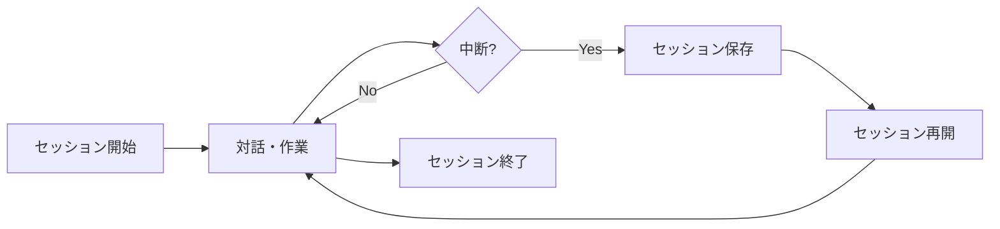

# セッション管理

Claude Codeのセッション管理機能を使用することで、作業を中断・再開したり、長期的なプロジェクトで継続性を保つことができます。

## セッションの基本概念

### セッションとは

セッションは、Claude Codeとの対話の開始から終了までの一連のやり取りを指します。セッションには以下の情報が含まれます：

- 会話履歴
- 読み込まれたファイル
- プロジェクトコンテキスト
- 実行されたコマンド
- 生成・編集されたコード

### セッションのライフサイクル



## セッションの開始

### 新規セッション

```bash
claude

# プロジェクトディレクトリを指定して開始
claude --project /path/to/project

# メモリを指定して開始
claude --memory ./custom-memory.md
```

### セッションIDの確認

```
/context session
```

出力例：
```
Session ID: claude-2024-01-15-14-30-45
Started: 2024-01-15 14:30:45
Duration: 45 minutes
Token usage: 15,234 / 100,000
```

## セッションの保存と再開

### 自動保存

Claude Codeは以下のタイミングで自動的にセッション情報を保存します：

- 重要な操作の完了後
- 一定時間（デフォルト5分）ごと
- 大きなファイルの処理後
- エラー発生時（リカバリ用）

### 手動保存

```
/save session
```

保存オプション：
```
/save session --name "feature-implementation"
/save session --description "認証機能の実装途中"
/save session --tags "auth,wip"
```

### セッションの再開

```bash
# 最後のセッションを再開
claude --resume

# 特定のセッションを再開
claude --resume session-id

# セッション一覧から選択
claude --resume --list
```

再開時の動作：
1. 前回の会話履歴を復元
2. ファイルコンテキストを再構築
3. メモリ設定を再適用
4. 作業を継続

## セッション管理コマンド

### セッション一覧

```
/sessions list
```

出力例：
```
Recent Sessions:
1. 2024-01-15 14:30 - "feature-implementation" [45 min]
2. 2024-01-15 10:15 - "bug-fix-auth" [30 min]
3. 2024-01-14 16:00 - "refactoring" [2 hours]
```

### セッション詳細

```
/sessions info [session-id]
```

詳細情報：
- 会話数
- 編集されたファイル
- 使用されたコマンド
- トークン使用量
- 主要なトピック

### セッションの削除

```
/sessions delete [session-id]
/sessions delete --older-than 30d
/sessions delete --all
```

## 高度なセッション管理

### セッションのエクスポート

```
/sessions export [session-id] --format json
/sessions export --all --output ./sessions-backup/
```

エクスポート形式：
- JSON: プログラマティックな処理用
- Markdown: 人間が読みやすい形式
- HTML: ブラウザでの閲覧用

### セッションのインポート

```bash
claude --import session-backup.json
```

### セッションの分割

長いセッションを論理的に分割：

```
/sessions split --at "marker"
/sessions split --by-topic
/sessions split --by-date
```

## ワークフロー統合

### Git連携

```bash
# Git branchごとにセッションを管理
claude --resume --git-branch

# コミット時にセッションを保存
git config --local claude.auto-save true
```

### プロジェクト別設定

`.claude/config.json`:
```json
{
  "session": {
    "autoSave": true,
    "saveInterval": 300,
    "maxSessions": 50,
    "gitIntegration": true
  }
}
```

### チーム共有

```bash
# セッションを共有用にエクスポート
/sessions share [session-id] --team

# 共有セッションをインポート
claude --import-shared [share-url]
```

## ベストプラクティス

### 1. 論理的なセッション区切り

```bash
# 機能ごとにセッションを分ける
claude --new-session --name "payment-feature"

# タスク完了時にセッションを終了
/save session --complete
/exit
```

### 2. セッションの命名規則

推奨される命名パターン：
- `feature-[機能名]-[日付]`
- `bugfix-[issue番号]-[概要]`
- `refactor-[対象]-[目的]`

### 3. 定期的なクリーンアップ

```bash
# 古いセッションを定期的に削除
claude sessions cleanup --older-than 30d

# 未完了セッションの確認
claude sessions list --incomplete
```

## トラブルシューティング

### セッションが再開できない

1. セッションIDを確認
```bash
claude sessions list --recent
```

2. セッションファイルの存在確認
```bash
ls ~/.claude/sessions/
```

3. 破損したセッションの修復
```bash
claude sessions repair [session-id]
```

### メモリ不足

セッションが大きすぎる場合：

```
/context stats
/sessions compact [session-id]
/clear history --keep-recent 100
```

### 同期の問題

複数デバイスでの作業：

```bash
# セッションを同期
claude sessions sync --cloud

# 競合の解決
claude sessions merge [session-id-1] [session-id-2]
```

## セキュリティとプライバシー

### セッションデータの保護

- ローカル暗号化（デフォルト有効）
- 機密情報の自動マスキング
- セッション有効期限の設定

### プライバシー設定

```json
{
  "privacy": {
    "maskSecrets": true,
    "excludePatterns": ["*.env", "*.key"],
    "sessionExpiry": "30d"
  }
}
```

### セッションの完全削除

```bash
# 復元不可能な削除
claude sessions purge [session-id] --confirm

# すべての履歴を削除
claude sessions purge --all --confirm
```

## パフォーマンス最適化

### セッションサイズの管理

```
/sessions optimize [session-id]
```

最適化内容：
- 重複する情報の削除
- 古い履歴の圧縮
- 不要なメタデータの削除

### 高速読み込み

```bash
# キャッシュを使用した高速起動
claude --resume --fast

# 最小限のコンテキストで開始
claude --resume --minimal
```

---

**関連ドキュメント:**
- [スラッシュコマンド](slash-commands.md) - セッション管理コマンド
- [メモリ管理機能](memory-management.md) - セッションとメモリの連携
- [設定ファイル詳細](../12-configuration.md) - セッション設定のカスタマイズ