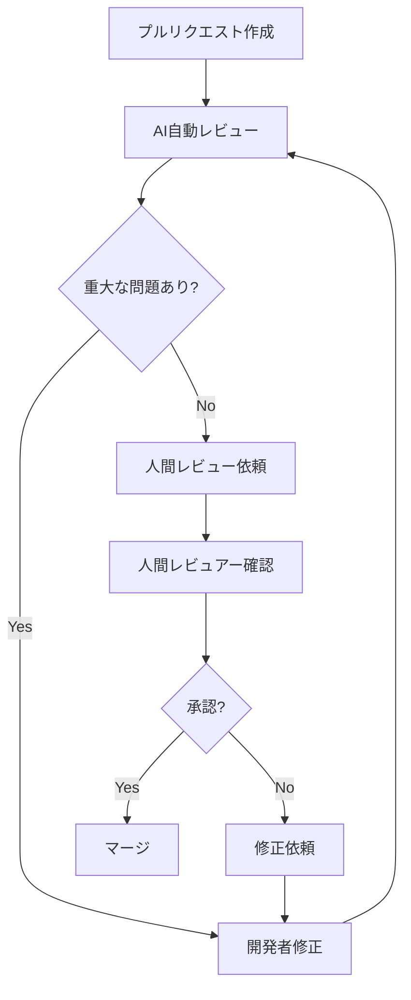

# AIによる設計レビュー

Claude Codeを活用した設計レビュープロセスについて説明します。自動レビューと人間レビューの効果的な組み合わせ方法を学習できます。

## AIによる設計レビューとは

従来の設計レビューは人間のレビュアーに依存していましたが、AI活用により客観的で一貫した品質チェックが可能になります。Claude Codeを使用することで、設計原則の遵守、パターンの適用、潜在的な問題の早期発見を自動化できます。

### AI設計レビューの利点

- **一貫性**: 主観に左右されない客観的な評価
- **効率性**: 24時間いつでも即座にレビュー実行
- **網羅性**: 人間が見落としがちな細かい点もチェック
- **学習効果**: レビューコメントから設計知識を習得

## 設計レビューのプロセス

### フェーズ1: 自動設計レビュー

#### ステップ1: 基本的な設計レビュー

**プロンプト例:**
```
以下の設計について、SOLID原則とクリーンアーキテクチャの
観点からレビューしてください：

設計対象: タスク管理システムのサービス層

```typescript
export class TaskService {
  constructor(
    private taskRepository: TaskRepository,
    private userRepository: UserRepository,
    private emailService: EmailService,
    private slackService: SlackService,
    private auditLogger: AuditLogger
  ) {}

  async createTask(data: CreateTaskData): Promise<Task> {
    // バリデーション
    if (!data.title || data.title.length > 255) {
      throw new Error('Invalid title');
    }

    // ユーザー存在確認
    const user = await this.userRepository.findById(data.createdBy);
    if (!user) {
      throw new Error('User not found');
    }

    // タスク作成
    const task = await this.taskRepository.create({
      ...data,
      id: generateId(),
      status: 'todo',
      createdAt: new Date()
    });

    // 通知送信
    if (data.assignedTo) {
      const assignee = await this.userRepository.findById(data.assignedTo);
      if (assignee) {
        await this.emailService.send({
          to: assignee.email,
          subject: 'New task assigned',
          body: `Task "${task.title}" has been assigned to you`
        });
        
        await this.slackService.sendMessage({
          channel: assignee.slackChannel,
          message: `New task: ${task.title}`
        });
      }
    }

    // 監査ログ
    await this.auditLogger.log({
      action: 'TASK_CREATED',
      userId: data.createdBy,
      taskId: task.id,
      timestamp: new Date()
    });

    return task;
  }
}
```

レビュー観点:
1. 単一責任原則の遵守
2. 依存関係の適切性
3. エラーハンドリング
4. 拡張性・保守性
```

**Claude Codeのレビュー結果:**```
# 設
計レビュー結果

## 🔴 重大な問題

### 1. 単一責任原則の違反
**問題**: TaskServiceが複数の責任を持っている
- タスクの作成
- 通知の送信
- 監査ログの記録

**影響**: 
- 変更理由が複数存在（通知方法の変更、監査要件の変更等）
- テストが困難
- 保守性の低下

**推奨修正**:
```typescript
// 責任を分離した設計
export class TaskService {
  constructor(
    private taskRepository: TaskRepository,
    private taskValidator: TaskValidator,
    private eventPublisher: EventPublisher
  ) {}

  async createTask(data: CreateTaskData): Promise<Task> {
    // バリデーション（専用クラスに委譲）
    await this.taskValidator.validate(data);

    // タスク作成（核心的責任）
    const task = await this.taskRepository.create({
      ...data,
      id: generateId(),
      status: 'todo',
      createdAt: new Date()
    });

    // イベント発行（副作用は外部に委譲）
    await this.eventPublisher.publish(new TaskCreatedEvent(task));

    return task;
  }
}

// 通知は別のハンドラーで処理
export class TaskNotificationHandler {
  constructor(
    private emailService: EmailService,
    private slackService: SlackService,
    private userRepository: UserRepository
  ) {}

  async handle(event: TaskCreatedEvent): Promise<void> {
    if (event.task.assignedTo) {
      const assignee = await this.userRepository.findById(event.task.assignedTo);
      if (assignee) {
        await Promise.all([
          this.emailService.send({
            to: assignee.email,
            subject: 'New task assigned',
            body: `Task "${event.task.title}" has been assigned to you`
          }),
          this.slackService.sendMessage({
            channel: assignee.slackChannel,
            message: `New task: ${event.task.title}`
          })
        ]);
      }
    }
  }
}
```

### 2. 依存関係の問題
**問題**: 具象クラスへの直接依存
- EmailService, SlackServiceへの直接依存
- 通知方法の追加時にTaskServiceの変更が必要

**推奨修正**:
```typescript
// インターフェースによる抽象化
interface NotificationService {
  notify(recipient: User, message: NotificationMessage): Promise<void>;
}

// 複数の通知方法を統合
export class CompositeNotificationService implements NotificationService {
  constructor(private services: NotificationService[]) {}

  async notify(recipient: User, message: NotificationMessage): Promise<void> {
    await Promise.all(
      this.services.map(service => service.notify(recipient, message))
    );
  }
}
```

## 🟡 改善推奨

### 3. エラーハンドリングの改善
**問題**: 汎用的なErrorクラスの使用
**推奨**: 専用のエラークラスを定義

```typescript
export class TaskValidationError extends Error {
  constructor(field: string, message: string) {
    super(`Validation failed for ${field}: ${message}`);
    this.name = 'TaskValidationError';
  }
}

export class UserNotFoundError extends Error {
  constructor(userId: string) {
    super(`User not found: ${userId}`);
    this.name = 'UserNotFoundError';
  }
}
```

### 4. バリデーションロジックの分離
**推奨**: 専用のバリデータークラス

```typescript
export class TaskValidator {
  async validate(data: CreateTaskData): Promise<void> {
    if (!data.title || data.title.trim().length === 0) {
      throw new TaskValidationError('title', 'Title is required');
    }

    if (data.title.length > 255) {
      throw new TaskValidationError('title', 'Title must be 255 characters or less');
    }

    // その他のバリデーションルール...
  }
}
```

## ✅ 良い点

1. **依存性注入**: コンストラクタでの依存関係注入は適切
2. **非同期処理**: async/awaitの適切な使用
3. **型安全性**: TypeScriptの型定義活用

## 総合評価: C (要改善)

主要な設計原則に違反しており、保守性と拡張性に問題があります。
責任の分離とイベント駆動アーキテクチャの導入を強く推奨します。
```

#### ステップ2: アーキテクチャレベルのレビュー

**プロンプト例:**
```
以下のシステムアーキテクチャについて、
スケーラビリティとパフォーマンスの観点からレビューしてください：

アーキテクチャ図:
```
Frontend (React SPA)
       ↓
API Gateway (Express.js)
       ↓
Application Services
       ↓
Database (PostgreSQL)
```

想定負荷:
- 同時ユーザー: 100名
- 1日のリクエスト数: 10万件
- データ量: 100万レコード

レビュー観点:
1. ボトルネックの特定
2. スケーラビリティの課題
3. パフォーマンス最適化の提案
4. 可用性の考慮
```

### フェーズ2: 設計パターンレビュー

#### ステップ3: デザインパターンの適用評価

**プロンプト例:**
```
以下のコードで使用されている設計パターンを評価し、
より適切なパターンがあれば提案してください：

```typescript
// 現在の実装
export class TaskManager {
  private tasks: Task[] = [];
  private observers: TaskObserver[] = [];

  addTask(task: Task): void {
    this.tasks.push(task);
    this.notifyObservers('taskAdded', task);
  }

  updateTask(id: string, updates: Partial<Task>): void {
    const index = this.tasks.findIndex(t => t.id === id);
    if (index !== -1) {
      this.tasks[index] = { ...this.tasks[index], ...updates };
      this.notifyObservers('taskUpdated', this.tasks[index]);
    }
  }

  addObserver(observer: TaskObserver): void {
    this.observers.push(observer);
  }

  private notifyObservers(event: string, task: Task): void {
    this.observers.forEach(observer => {
      if (event === 'taskAdded') observer.onTaskAdded?.(task);
      if (event === 'taskUpdated') observer.onTaskUpdated?.(task);
    });
  }
}
```

評価観点:
1. パターンの適切性
2. 実装の品質
3. 拡張性
4. 代替パターンの提案
```

### フェーズ3: セキュリティレビュー

#### ステップ4: セキュリティ設計の評価

**プロンプト例:**
```
以下の認証・認可設計について、
セキュリティの観点からレビューしてください：

```typescript
// 認証ミドルウェア
export const authMiddleware = async (req: Request, res: Response, next: NextFunction) => {
  const token = req.headers.authorization?.replace('Bearer ', '');
  
  if (!token) {
    return res.status(401).json({ error: 'Token required' });
  }

  try {
    const decoded = jwt.verify(token, process.env.JWT_SECRET!) as JWTPayload;
    const user = await User.findById(decoded.userId);
    
    if (!user || !user.isActive) {
      return res.status(401).json({ error: 'Invalid user' });
    }

    req.user = user;
    next();
  } catch (error) {
    return res.status(401).json({ error: 'Invalid token' });
  }
};

// 認可チェック
export const requireRole = (roles: string[]) => {
  return (req: Request, res: Response, next: NextFunction) => {
    if (!req.user || !roles.includes(req.user.role)) {
      return res.status(403).json({ error: 'Insufficient permissions' });
    }
    next();
  };
};
```

セキュリティチェック項目:
1. 認証の強度
2. トークン管理
3. 認可の適切性
4. 攻撃耐性
5. 情報漏洩リスク
```

## 自動レビューツールの構築

### 1. レビューチェックリストの自動化

**プロンプト例:**
```
以下のチェックリストを自動化するための
Claude Code用プロンプトテンプレートを作成してください：

設計レビューチェックリスト:
□ SOLID原則の遵守
□ 適切な抽象化レベル
□ エラーハンドリングの実装
□ セキュリティ考慮事項
□ パフォーマンス考慮事項
□ テスト容易性
□ ドキュメント化

各項目について、具体的なチェック方法と
改善提案を含むテンプレートを作成してください。
```

### 2. 継続的レビューの仕組み

**GitHub Actions統合例:**
```yaml
name: AI Design Review

on:
  pull_request:
    paths:
      - 'src/**/*.ts'
      - 'src/**/*.tsx'

jobs:
  ai-review:
    runs-on: ubuntu-latest
    steps:
      - uses: actions/checkout@v4
      
      - name: AI Design Review
        uses: ./.github/actions/claude-review
        with:
          files: ${{ github.event.pull_request.changed_files }}
          review-type: 'design'
          
      - name: Post Review Comments
        uses: actions/github-script@v7
        with:
          script: |
            const review = require('./ai-review-results.json');
            
            for (const comment of review.comments) {
              await github.rest.pulls.createReviewComment({
                owner: context.repo.owner,
                repo: context.repo.repo,
                pull_number: context.issue.number,
                body: comment.message,
                path: comment.file,
                line: comment.line
              });
            }
```

## 人間レビューとの統合

### 1. レビューの役割分担

| 項目 | AIレビュー | 人間レビュー |
|------|------------|--------------|
| SOLID原則チェック | ✅ 主担当 | 🔄 確認 |
| パフォーマンス | ✅ 主担当 | 🔄 確認 |
| セキュリティ | ✅ 主担当 | ✅ 主担当 |
| ビジネスロジック | 🔄 補助 | ✅ 主担当 |
| UX/UI設計 | ❌ 対象外 | ✅ 主担当 |
| 技術選択 | 🔄 補助 | ✅ 主担当 |

### 2. ハイブリッドレビュープロセス



### 3. レビュー品質の向上

**フィードバックループの構築:**
```typescript
// レビュー結果の追跡
interface ReviewMetrics {
  aiReviewAccuracy: number;      // AI指摘の正確性
  humanReviewTime: number;       // 人間レビュー時間
  issueDetectionRate: number;    // 問題検出率
  falsePositiveRate: number;     // 誤検出率
}

// 継続的改善
const improveReviewProcess = (metrics: ReviewMetrics) => {
  if (metrics.falsePositiveRate > 0.2) {
    // AIプロンプトの調整
    updateReviewPrompts();
  }
  
  if (metrics.humanReviewTime > targetTime) {
    // AI事前チェックの強化
    enhancePreReviewChecks();
  }
};
```

## レビュー結果の活用

### 1. 学習効果の最大化

**プロンプト例:**
```
以下のAIレビュー結果を基に、
チーム向けの学習資料を作成してください：

よく指摘される問題:
1. 単一責任原則の違反 (40%)
2. 適切でないエラーハンドリング (30%)
3. セキュリティ考慮不足 (20%)
4. パフォーマンス問題 (10%)

各問題について:
- 具体的な改善方法
- ベストプラクティス
- 実装例
- 参考資料

を含む学習資料を作成してください。
```

### 2. 設計原則の更新

**継続的改善プロセス:**
```markdown
## レビュー結果に基づく原則更新

### 月次レビュー会議
1. AIレビュー結果の分析
2. 頻出問題の特定
3. 設計原則の見直し
4. CLAUDE.mdの更新

### 四半期レビュー
1. レビュープロセスの効果測定
2. AIプロンプトの最適化
3. チーム教育計画の策定
```

## 次のステップ

AIによる設計レビューを理解したら：

1. **[単体テスト](06-unit-testing.md)** - 設計品質を検証するテスト
2. **[結合テスト](07-integration-testing.md)** - システム全体の品質保証
3. **[チーム開発](../07-team-development/README.md)** - チーム全体でのレビュー文化

---

**関連ドキュメント:**
- [設計原則管理](03-design-principles.md) - レビュー基準の設定
- [コードレビュー](../02-features/code-review.md) - 実装レベルでのレビュー
- [外部ツール連携](../02-features/integration-tools.md) - CI/CDでの自動化