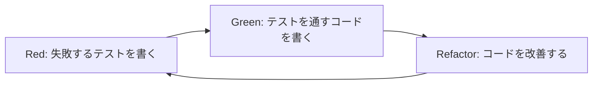

# 単体テスト

Claude Codeを活用した単体テスト作成について説明します。テスト駆動開発の実践とテストカバレッジの向上方法を学習できます。

## 単体テストとは

単体テストは、アプリケーションの最小単位（関数、メソッド、クラス）を個別にテストする手法です。Claude Codeを活用することで、効率的で高品質なテストコードを作成できます。

### Claude Code活用の利点

- **テストケースの自動生成**: 関数の仕様からテストケースを自動生成
- **エッジケースの特定**: 人間が見落としがちなテストケースの提案
- **テストコードの品質向上**: ベストプラクティスに従ったテストコード
- **保守性の向上**: 理解しやすいテストコードの生成

## テスト駆動開発（TDD）

### TDDサイクル



### Claude Codeでのテスト駆動開発

#### ステップ1: テスト仕様の作成

**プロンプト:**
```
以下の要件に基づいて、単体テストの仕様を作成してください：

機能: ユーザーパスワード検証関数
要件:
- パスワードは8文字以上
- 大文字、小文字、数字、記号を含む
- 連続する同じ文字は3文字まで
- よくあるパスワード（password123等）は禁止

テスト仕様:
- 正常系テストケース
- 異常系テストケース
- 境界値テストケース
- エッジケースの特定

Jest + TypeScriptで実装してください。
```

**生成されるテスト仕様:**
```typescript
// src/utils/passwordValidator.test.ts
import { validatePassword, PasswordValidationResult } from './passwordValidator';

describe('passwordValidator', () => {
  describe('正常系テスト', () => {
    test.each([
      ['ValidPass123!', '有効なパスワード'],
      ['MySecure@Pass1', '記号を含む有効なパスワード'],
      ['Complex#Pass99', '複雑なパスワード'],
      ['Str0ng$Password', '長いパスワード']
    ])('有効なパスワード: %s', (password, description) => {
      const result = validatePassword(password);
      expect(result.isValid).toBe(true);
      expect(result.errors).toHaveLength(0);
    });
  });

  describe('異常系テスト - 長さ不足', () => {
    test.each([
      ['', '空文字'],
      ['Pass1!', '7文字'],
      ['Abc123!', '7文字（境界値）']
    ])('無効なパスワード（長さ不足）: %s', (password, description) => {
      const result = validatePassword(password);
      expect(result.isValid).toBe(false);
      expect(result.errors).toContain('パスワードは8文字以上である必要があります');
    });
  });

  describe('異常系テスト - 文字種不足', () => {
    test('大文字なし', () => {
      const result = validatePassword('password123!');
      expect(result.isValid).toBe(false);
      expect(result.errors).toContain('大文字を含む必要があります');
    });

    test('小文字なし', () => {
      const result = validatePassword('PASSWORD123!');
      expect(result.isValid).toBe(false);
      expect(result.errors).toContain('小文字を含む必要があります');
    });

    test('数字なし', () => {
      const result = validatePassword('Password!');
      expect(result.isValid).toBe(false);
      expect(result.errors).toContain('数字を含む必要があります');
    });

    test('記号なし', () => {
      const result = validatePassword('Password123');
      expect(result.isValid).toBe(false);
      expect(result.errors).toContain('記号を含む必要があります');
    });
  });

  describe('異常系テスト - 連続文字', () => {
    test.each([
      ['Passsword123!', '連続する同じ文字（4文字）'],
      ['Password1111!', '連続する数字（4文字）'],
      ['Pass!!!!word1', '連続する記号（4文字）']
    ])('連続文字エラー: %s', (password, description) => {
      const result = validatePassword(password);
      expect(result.isValid).toBe(false);
      expect(result.errors).toContain('同じ文字を3文字以上連続して使用できません');
    });
  });

  describe('異常系テスト - よくあるパスワード', () => {
    test.each([
      ['password123', 'よくあるパスワード1'],
      ['Password123', 'よくあるパスワード2'],
      ['123456789', '連続数字'],
      ['qwerty123', 'キーボード配列']
    ])('よくあるパスワード: %s', (password, description) => {
      const result = validatePassword(password);
      expect(result.isValid).toBe(false);
      expect(result.errors).toContain('よくあるパスワードは使用できません');
    });
  });

  describe('境界値テスト', () => {
    test('最小有効長（8文字）', () => {
      const result = validatePassword('Pass123!');
      expect(result.isValid).toBe(true);
    });

    test('連続文字境界値（3文字）', () => {
      const result = validatePassword('Passsword123!'); // sが3文字連続
      expect(result.isValid).toBe(true);
    });

    test('最大長テスト（128文字）', () => {
      const longPassword = 'A'.repeat(60) + 'a'.repeat(60) + '1234567!';
      const result = validatePassword(longPassword);
      expect(result.isValid).toBe(true);
    });
  });

  describe('エッジケース', () => {
    test('null入力', () => {
      const result = validatePassword(null as any);
      expect(result.isValid).toBe(false);
      expect(result.errors).toContain('パスワードが入力されていません');
    });

    test('undefined入力', () => {
      const result = validatePassword(undefined as any);
      expect(result.isValid).toBe(false);
      expect(result.errors).toContain('パスワードが入力されていません');
    });

    test('Unicode文字を含むパスワード', () => {
      const result = validatePassword('Pässwörd123!');
      expect(result.isValid).toBe(true);
    });

    test('絵文字を含むパスワード', () => {
      const result = validatePassword('Password123!😀');
      expect(result.isValid).toBe(true);
    });
  });
});
```

#### ステップ2: 実装コードの作成

**プロンプト:**
```
上記のテスト仕様を満たすpasswordValidator関数を実装してください。

要件:
- TypeScriptで型安全な実装
- 適切なエラーハンドリング
- パフォーマンスを考慮した実装
- 拡張可能な設計
```

**生成される実装:**
```typescript
// src/utils/passwordValidator.ts
export interface PasswordValidationResult {
  isValid: boolean;
  errors: string[];
  strength?: 'weak' | 'medium' | 'strong';
}

interface ValidationRule {
  test: (password: string) => boolean;
  errorMessage: string;
}

export class PasswordValidator {
  private static readonly COMMON_PASSWORDS = new Set([
    'password', 'password123', '123456789', 'qwerty123',
    'admin', 'letmein', 'welcome', 'monkey', 'dragon'
  ]);

  private static readonly VALIDATION_RULES: ValidationRule[] = [
    {
      test: (password: string) => password.length >= 8,
      errorMessage: 'パスワードは8文字以上である必要があります'
    },
    {
      test: (password: string) => /[A-Z]/.test(password),
      errorMessage: '大文字を含む必要があります'
    },
    {
      test: (password: string) => /[a-z]/.test(password),
      errorMessage: '小文字を含む必要があります'
    },
    {
      test: (password: string) => /\d/.test(password),
      errorMessage: '数字を含む必要があります'
    },
    {
      test: (password: string) => /[!@#$%^&*()_+\-=\[\]{};':"\\|,.<>\/?]/.test(password),
      errorMessage: '記号を含む必要があります'
    }
  ];

  static validate(password: string): PasswordValidationResult {
    // null/undefined チェック
    if (password == null) {
      return {
        isValid: false,
        errors: ['パスワードが入力されていません']
      };
    }

    const errors: string[] = [];

    // 基本ルールの検証
    for (const rule of this.VALIDATION_RULES) {
      if (!rule.test(password)) {
        errors.push(rule.errorMessage);
      }
    }

    // 連続文字チェック
    if (this.hasConsecutiveChars(password, 4)) {
      errors.push('同じ文字を3文字以上連続して使用できません');
    }

    // よくあるパスワードチェック
    if (this.isCommonPassword(password)) {
      errors.push('よくあるパスワードは使用できません');
    }

    const isValid = errors.length === 0;
    const strength = isValid ? this.calculateStrength(password) : undefined;

    return {
      isValid,
      errors,
      strength
    };
  }

  private static hasConsecutiveChars(password: string, maxConsecutive: number): boolean {
    for (let i = 0; i <= password.length - maxConsecutive; i++) {
      const char = password[i];
      let consecutive = 1;
      
      for (let j = i + 1; j < password.length && password[j] === char; j++) {
        consecutive++;
        if (consecutive >= maxConsecutive) {
          return true;
        }
      }
    }
    return false;
  }

  private static isCommonPassword(password: string): boolean {
    const lowerPassword = password.toLowerCase();
    return this.COMMON_PASSWORDS.has(lowerPassword) ||
           this.COMMON_PASSWORDS.has(lowerPassword.replace(/\d+$/, ''));
  }

  private static calculateStrength(password: string): 'weak' | 'medium' | 'strong' {
    let score = 0;
    
    // 長さによるスコア
    if (password.length >= 12) score += 2;
    else if (password.length >= 10) score += 1;
    
    // 文字種の多様性
    if (/[A-Z]/.test(password)) score += 1;
    if (/[a-z]/.test(password)) score += 1;
    if (/\d/.test(password)) score += 1;
    if (/[!@#$%^&*()_+\-=\[\]{};':"\\|,.<>\/?]/.test(password)) score += 1;
    
    // 複雑なパターン
    if (/[A-Z].*[a-z].*\d/.test(password) || /\d.*[a-z].*[A-Z]/.test(password)) {
      score += 1;
    }
    
    if (score >= 6) return 'strong';
    if (score >= 4) return 'medium';
    return 'weak';
  }
}

// 便利関数
export const validatePassword = (password: string): PasswordValidationResult => {
  return PasswordValidator.validate(password);
};
```

## モックとスタブの活用

### 外部依存のモック化

**プロンプト:**
```
以下のUserServiceクラスの単体テストを作成してください。
外部依存（API、データベース）は適切にモック化してください。

```typescript
export class UserService {
  constructor(
    private userRepository: UserRepository,
    private emailService: EmailService,
    private logger: Logger
  ) {}

  async createUser(userData: CreateUserData): Promise<User> {
    this.logger.info('Creating user', { email: userData.email });
    
    const existingUser = await this.userRepository.findByEmail(userData.email);
    if (existingUser) {
      throw new Error('User already exists');
    }

    const user = await this.userRepository.create(userData);
    await this.emailService.sendWelcomeEmail(user.email, user.name);
    
    this.logger.info('User created successfully', { userId: user.id });
    return user;
  }
}
```

テスト要件:
- 依存関係の適切なモック化
- 正常系・異常系のテストケース
- モックの呼び出し検証
- エラーハンドリングのテスト
```

**生成されるテストコード:**
```typescript
// src/services/UserService.test.ts
import { UserService } from './UserService';
import { UserRepository } from '../repositories/UserRepository';
import { EmailService } from './EmailService';
import { Logger } from '../utils/Logger';
import { CreateUserData, User } from '../types/User';

// モックの作成
jest.mock('../repositories/UserRepository');
jest.mock('./EmailService');
jest.mock('../utils/Logger');

describe('UserService', () => {
  let userService: UserService;
  let mockUserRepository: jest.Mocked<UserRepository>;
  let mockEmailService: jest.Mocked<EmailService>;
  let mockLogger: jest.Mocked<Logger>;

  const mockUser: User = {
    id: '123',
    name: 'Test User',
    email: 'test@example.com',
    createdAt: new Date(),
    updatedAt: new Date()
  };

  const mockUserData: CreateUserData = {
    name: 'Test User',
    email: 'test@example.com',
    password: 'password123'
  };

  beforeEach(() => {
    // モックインスタンスの作成
    mockUserRepository = {
      findByEmail: jest.fn(),
      create: jest.fn(),
      findById: jest.fn(),
      update: jest.fn(),
      delete: jest.fn()
    } as jest.Mocked<UserRepository>;

    mockEmailService = {
      sendWelcomeEmail: jest.fn(),
      sendPasswordResetEmail: jest.fn()
    } as jest.Mocked<EmailService>;

    mockLogger = {
      info: jest.fn(),
      error: jest.fn(),
      warn: jest.fn(),
      debug: jest.fn()
    } as jest.Mocked<Logger>;

    userService = new UserService(
      mockUserRepository,
      mockEmailService,
      mockLogger
    );
  });

  afterEach(() => {
    jest.clearAllMocks();
  });

  describe('createUser', () => {
    describe('正常系', () => {
      test('新規ユーザーを正常に作成できる', async () => {
        // Arrange
        mockUserRepository.findByEmail.mockResolvedValue(null);
        mockUserRepository.create.mockResolvedValue(mockUser);
        mockEmailService.sendWelcomeEmail.mockResolvedValue(undefined);

        // Act
        const result = await userService.createUser(mockUserData);

        // Assert
        expect(result).toEqual(mockUser);
        expect(mockUserRepository.findByEmail).toHaveBeenCalledWith(mockUserData.email);
        expect(mockUserRepository.create).toHaveBeenCalledWith(mockUserData);
        expect(mockEmailService.sendWelcomeEmail).toHaveBeenCalledWith(
          mockUser.email,
          mockUser.name
        );
        expect(mockLogger.info).toHaveBeenCalledTimes(2);
        expect(mockLogger.info).toHaveBeenNthCalledWith(1, 'Creating user', {
          email: mockUserData.email
        });
        expect(mockLogger.info).toHaveBeenNthCalledWith(2, 'User created successfully', {
          userId: mockUser.id
        });
      });

      test('メール送信が失敗してもユーザー作成は成功する', async () => {
        // Arrange
        mockUserRepository.findByEmail.mockResolvedValue(null);
        mockUserRepository.create.mockResolvedValue(mockUser);
        mockEmailService.sendWelcomeEmail.mockRejectedValue(new Error('Email service error'));

        // Act & Assert
        await expect(userService.createUser(mockUserData)).rejects.toThrow('Email service error');
        expect(mockUserRepository.create).toHaveBeenCalledWith(mockUserData);
      });
    });

    describe('異常系', () => {
      test('既存ユーザーが存在する場合はエラーを投げる', async () => {
        // Arrange
        mockUserRepository.findByEmail.mockResolvedValue(mockUser);

        // Act & Assert
        await expect(userService.createUser(mockUserData)).rejects.toThrow('User already exists');
        expect(mockUserRepository.findByEmail).toHaveBeenCalledWith(mockUserData.email);
        expect(mockUserRepository.create).not.toHaveBeenCalled();
        expect(mockEmailService.sendWelcomeEmail).not.toHaveBeenCalled();
      });

      test('データベースエラーが発生した場合は適切にエラーを伝播する', async () => {
        // Arrange
        const dbError = new Error('Database connection failed');
        mockUserRepository.findByEmail.mockRejectedValue(dbError);

        // Act & Assert
        await expect(userService.createUser(mockUserData)).rejects.toThrow('Database connection failed');
        expect(mockUserRepository.create).not.toHaveBeenCalled();
        expect(mockEmailService.sendWelcomeEmail).not.toHaveBeenCalled();
      });

      test('ユーザー作成時にデータベースエラーが発生した場合', async () => {
        // Arrange
        const createError = new Error('Failed to create user');
        mockUserRepository.findByEmail.mockResolvedValue(null);
        mockUserRepository.create.mockRejectedValue(createError);

        // Act & Assert
        await expect(userService.createUser(mockUserData)).rejects.toThrow('Failed to create user');
        expect(mockEmailService.sendWelcomeEmail).not.toHaveBeenCalled();
      });
    });

    describe('モック呼び出し検証', () => {
      test('依存関係が正しい順序で呼び出される', async () => {
        // Arrange
        mockUserRepository.findByEmail.mockResolvedValue(null);
        mockUserRepository.create.mockResolvedValue(mockUser);
        mockEmailService.sendWelcomeEmail.mockResolvedValue(undefined);

        // Act
        await userService.createUser(mockUserData);

        // Assert - 呼び出し順序の検証
        const mockCalls = [
          mockLogger.info.mock.calls[0],
          mockUserRepository.findByEmail.mock.calls[0],
          mockUserRepository.create.mock.calls[0],
          mockEmailService.sendWelcomeEmail.mock.calls[0],
          mockLogger.info.mock.calls[1]
        ];

        expect(mockCalls).toHaveLength(5);
      });

      test('メール送信の引数が正しい', async () => {
        // Arrange
        mockUserRepository.findByEmail.mockResolvedValue(null);
        mockUserRepository.create.mockResolvedValue(mockUser);
        mockEmailService.sendWelcomeEmail.mockResolvedValue(undefined);

        // Act
        await userService.createUser(mockUserData);

        // Assert
        expect(mockEmailService.sendWelcomeEmail).toHaveBeenCalledWith(
          mockUser.email,
          mockUser.name
        );
        expect(mockEmailService.sendWelcomeEmail).toHaveBeenCalledTimes(1);
      });
    });
  });
});
```

## テストカバレッジの向上

### カバレッジレポートの設定

**Jest設定例:**
```javascript
// jest.config.js
module.exports = {
  collectCoverage: true,
  collectCoverageFrom: [
    'src/**/*.{ts,tsx}',
    '!src/**/*.d.ts',
    '!src/**/*.test.{ts,tsx}',
    '!src/**/*.spec.{ts,tsx}',
    '!src/index.ts'
  ],
  coverageDirectory: 'coverage',
  coverageReporters: ['text', 'lcov', 'html', 'json-summary'],
  coverageThreshold: {
    global: {
      branches: 80,
      functions: 80,
      lines: 80,
      statements: 80
    },
    './src/services/': {
      branches: 90,
      functions: 90,
      lines: 90,
      statements: 90
    }
  }
};
```

### カバレッジ改善のプロンプト

**プロンプト:**
```
以下のカバレッジレポートを分析して、
テストカバレッジを向上させるテストケースを提案してください：

カバレッジレポート:
- Lines: 75% (目標: 80%)
- Functions: 70% (目標: 80%)
- Branches: 65% (目標: 80%)

未カバーの箇所:
- src/utils/dateUtils.ts: 行 25-30 (エラーハンドリング)
- src/services/PaymentService.ts: 行 45-50 (例外処理)
- src/components/UserForm.tsx: 行 80-85 (バリデーション分岐)

各箇所について、適切なテストケースを作成してください。
```

## 次のステップ

単体テストを理解したら：

1. **[結合テスト](07-integration-testing.md)** - システム間連携のテスト
2. **[E2Eテスト](08-e2e-testing.md)** - エンドツーエンドテスト
3. **[ビルド自動化](09-build-automation.md)** - CI/CDでのテスト自動化

---

**関連ドキュメント:**
- [テスト基礎](../05-testing-basics.md) - テスト全般の基礎
- [デバッグサポート](../02-features/debugging-support.md) - テストデバッグ
- [コードレビュー](../02-features/code-review.md) - テスト品質の向上