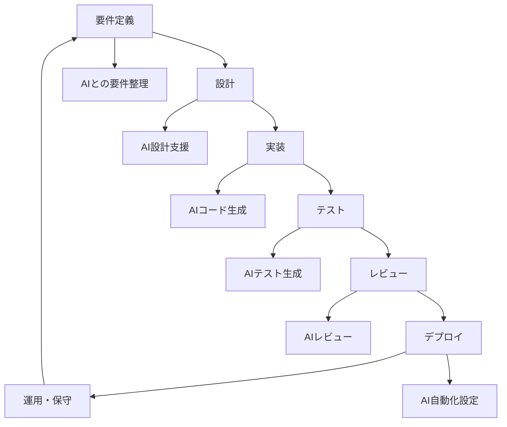
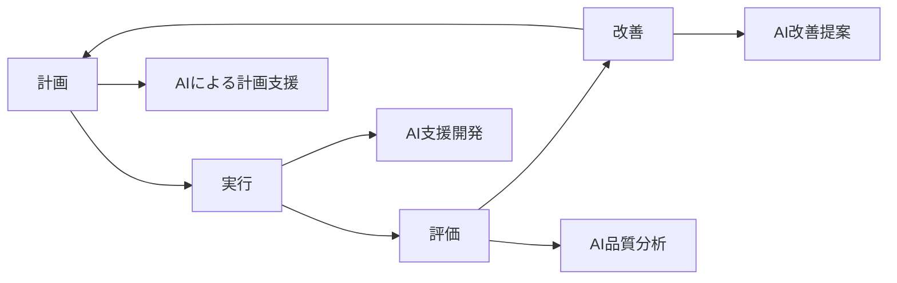

# 体系的な開発プロセス

Claude Codeを活用した本格的なアプリ開発プロセスについて説明します。AIを活用した要件定義から設計、実装、テスト、デプロイまでの体系的な手法を学習できます。

## 開発プロセス概要

### 従来の開発プロセスとAI活用開発の違い

| フェーズ | 従来の手法 | AI活用開発 |
|----------|------------|------------|
| 要件定義 | 手動での要件整理 | AIとの対話による要件抽出・整理 |
| 設計 | 個人の経験に依存 | AIによる設計パターン提案・レビュー |
| 実装 | 手動コーディング | AI支援によるコード生成・編集 |
| テスト | 手動テスト作成 | AI生成テストコード |
| レビュー | 人間のみ | AI + 人間のハイブリッドレビュー |
| デプロイ | 手動設定 | AI支援による自動化設定 |

### AI活用開発の利点

- **効率性**: 定型作業の自動化により開発速度が向上
- **品質**: AIによる一貫したコード品質とベストプラクティスの適用
- **学習効果**: AIとの対話を通じた技術スキルの向上
- **創造性**: 定型作業から解放され、より高次の設計に集中可能

## 開発フロー



## 各フェーズの詳細

### 1. [AIと要件定義](01-requirements-with-ai.md)
- AIとの対話による要件抽出
- ステークホルダーとの要件整理
- 要件の優先順位付けと検証

### 2. [AIと設計](02-design-with-ai.md)
- アーキテクチャ設計の支援
- 設計パターンの提案と適用
- 技術選択の意思決定支援

### 3. [設計原則とCLAUDE.md](03-design-principles.md)
- プロジェクト固有の設計原則管理
- CLAUDE.mdファイルでの原則記録
- チーム間での設計方針共有

### 4. [個人設計原則管理](04-personal-guidelines.md)
- 個人用設計指針の管理方法
- チーム原則との使い分け
- 継続的な原則の改善

### 5. [AIによる設計レビュー](05-ai-design-review.md)
- 自動設計レビューの実施
- 人間レビューとの効果的な組み合わせ
- レビュー結果の活用方法

### 6. [単体テスト](06-unit-testing.md)
- AI支援による単体テスト作成
- テスト駆動開発の実践
- テストカバレッジの向上

### 7. [結合テスト](07-integration-testing.md)
- 結合テスト仕様書の作成
- APIテストの自動化
- システム間連携のテスト

### 8. [E2Eテスト](08-e2e-testing.md)
- エンドツーエンドテスト設計
- ユーザーシナリオベースのテスト
- 自動化とCI/CD統合

### 9. [ビルド自動化](09-build-automation.md)
- CI/CDパイプラインの構築
- 自動ビルドとテスト実行
- 品質ゲートの設定

### 10. [デプロイ自動化](10-deployment-automation.md)
- 自動デプロイメントの設定
- 環境管理とロールバック
- 監視とアラートの設定

## 開発プロセスの選択

### プロジェクト規模別の推奨プロセス

#### 小規模プロジェクト（1-2人、1-3ヶ月）
```
要件定義 → 設計 → 実装 → テスト → デプロイ
```
- 軽量なプロセス
- AIによる効率化重視
- 最小限のドキュメント

#### 中規模プロジェクト（3-10人、3-12ヶ月）
```
要件定義 → 設計 → 設計レビュー → 実装 → テスト → コードレビュー → デプロイ
```
- 設計レビューの追加
- チーム間の設計原則共有
- 自動化の導入

#### 大規模プロジェクト（10人以上、12ヶ月以上）
```
要件定義 → アーキテクチャ設計 → 詳細設計 → 設計レビュー → 実装 → 
単体テスト → 結合テスト → E2Eテスト → コードレビュー → デプロイ → 運用
```
- 段階的な設計プロセス
- 包括的なテスト戦略
- 運用・保守フェーズの追加

## 品質管理

### 品質指標

1. **コード品質**
   - 静的解析スコア
   - テストカバレッジ
   - 複雑度メトリクス

2. **設計品質**
   - アーキテクチャ適合性
   - 設計原則の遵守
   - 技術的負債の管理

3. **プロセス品質**
   - 要件の充足度
   - スケジュール遵守
   - 欠陥密度

### 継続的改善



## ツールチェーン

### 推奨ツール構成

```yaml
開発環境:
  - IDE: VS Code + Claude Code拡張
  - バージョン管理: Git + GitHub
  - プロジェクト管理: GitHub Issues/Projects

品質管理:
  - 静的解析: ESLint, SonarQube
  - テスト: Jest, Playwright
  - カバレッジ: Istanbul

CI/CD:
  - ビルド: GitHub Actions
  - デプロイ: Docker + Kubernetes
  - 監視: Prometheus + Grafana

AI支援:
  - コード生成: Claude Code
  - レビュー: AI Code Review
  - テスト生成: AI Test Generator
```

## 学習パス

### 初心者向け（基本プロセス習得）
1. [AIと要件定義](01-requirements-with-ai.md)
2. [AIと設計](02-design-with-ai.md)
3. [単体テスト](06-unit-testing.md)
4. [ビルド自動化](09-build-automation.md)

### 中級者向け（品質向上）
1. [設計原則管理](03-design-principles.md)
2. [AIによる設計レビュー](05-ai-design-review.md)
3. [結合テスト](07-integration-testing.md)
4. [E2Eテスト](08-e2e-testing.md)

### 上級者向け（プロセス最適化）
1. [個人設計原則管理](04-personal-guidelines.md)
2. [デプロイ自動化](10-deployment-automation.md)
3. [チーム開発](../07-team-development/README.md)
4. [大規模開発テクニック](../07-team-development/05-large-scale-techniques.md)

## 成功事例

### ケーススタディ1: スタートアップでの活用
- **プロジェクト**: ECサイト構築
- **チーム規模**: 3人
- **期間**: 2ヶ月
- **成果**: 開発効率50%向上、バグ数30%削減

### ケーススタディ2: エンタープライズでの活用
- **プロジェクト**: 基幹システム刷新
- **チーム規模**: 20人
- **期間**: 12ヶ月
- **成果**: 設計品質向上、保守性40%改善

## 次のステップ

体系的な開発プロセスの概要を理解したら、具体的な各フェーズの学習に進みましょう：

### すぐに始められる
1. **[AIと要件定義](01-requirements-with-ai.md)** - プロジェクトの出発点
2. **[設計原則管理](03-design-principles.md)** - 品質の基盤作り

### 段階的に習得
1. **[AIと設計](02-design-with-ai.md)** - 設計スキルの向上
2. **[単体テスト](06-unit-testing.md)** - 品質保証の基礎

### 高度な活用
1. **[AIによる設計レビュー](05-ai-design-review.md)** - 品質管理の自動化
2. **[デプロイ自動化](10-deployment-automation.md)** - 運用効率の向上

---

**ナビゲーション:**
- ⬅️ 前へ: [テスト基礎](../05-testing-basics.md) - テスト自動化の基礎
- ➡️ 次へ: [AIと要件定義](01-requirements-with-ai.md) - AI支援による要件整理

**関連ドキュメント:**
- [簡単なアプリ作成](../04-quick-tutorial.md) - 実践的な開発体験
- [チーム開発](../07-team-development/README.md) - チーム規模での開発
- [サンプル集](../08-examples/README.md) - 実用的なプロジェクト例