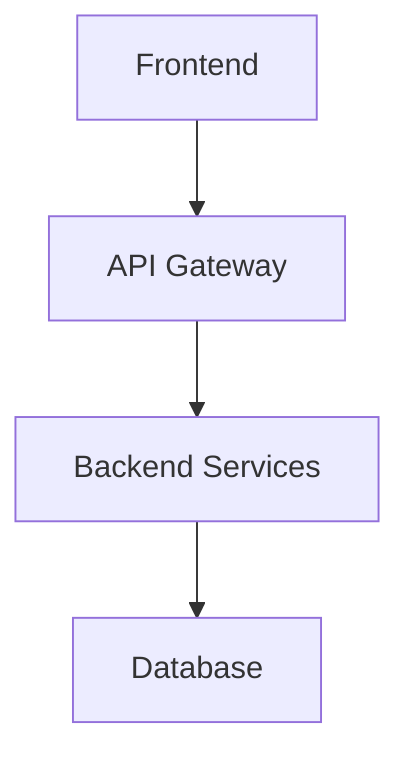

# 共有コンテキスト管理

チーム開発において、Claude Codeを効果的に活用するための共有コンテキストとメモリ管理について解説します。チーム全体で一貫した開発体験を実現し、知識の共有と継承を促進する仕組みを構築します。

## 概要

### 共有コンテキストの重要性

チーム開発では、個人の知識や経験をチーム全体で共有することが重要です：

- **一貫性の確保**: 全メンバーが同じ前提で開発を進められる
- **知識の継承**: 属人化を防ぎ、チーム全体のスキル向上を実現
- **効率の向上**: 重複する学習や試行錯誤を削減
- **品質の統一**: 共通の基準とベストプラクティスを適用

### 管理すべきコンテキスト

1. **プロジェクト固有の知識**: アーキテクチャ、設計決定、技術選択
2. **チーム規約**: コーディング規約、レビュー基準、ワークフロー
3. **ドメイン知識**: ビジネスロジック、要件、制約条件
4. **技術的ノウハウ**: 解決済みの問題、ベストプラクティス、回避すべき落とし穴
5. **外部連携情報**: API仕様、サードパーティツール設定、環境情報

## 共有コンテキスト管理システム

### システム構成

```
team-shared-context/
├── README.md                    # 共有コンテキスト管理ガイド
├── project-context/             # プロジェクト固有情報
│   ├── architecture.md         # システムアーキテクチャ
│   ├── design-decisions.md     # 設計決定記録
│   ├── api-specifications.md   # API仕様
│   └── domain-knowledge.md     # ドメイン知識
├── team-standards/              # チーム標準
│   ├── coding-standards.md     # コーディング規約
│   ├── review-guidelines.md    # レビューガイドライン
│   ├── workflow.md             # 開発ワークフロー
│   └── quality-gates.md        # 品質基準
├── claude-context/              # Claude Code用コンテキスト
│   ├── project-prompts/         # プロジェクト固有プロンプト
│   ├── shared-memory/           # 共有メモリファイル
│   ├── code-patterns/           # コードパターン集
│   └── troubleshooting/         # 問題解決事例
├── knowledge-base/              # ナレッジベース
│   ├── lessons-learned.md      # 学習事項
│   ├── best-practices.md       # ベストプラクティス
│   ├── common-issues.md        # よくある問題
│   └── external-resources.md   # 外部リソース
└── templates/                   # テンプレート集
    ├── claude-prompts/          # プロンプトテンプレート
    ├── code-templates/          # コードテンプレート
    └── document-templates/      # ドキュメントテンプレート
```

### 1. プロジェクト固有情報の管理

#### アーキテクチャドキュメント

**project-context/architecture.md**:
```markdown
# システムアーキテクチャ

## 概要
[プロジェクトの全体的なアーキテクチャ概要]

## アーキテクチャ図


## 主要コンポーネント

### Frontend
- **技術スタック**: React + TypeScript + Vite
- **責務**: ユーザーインターフェース、状態管理
- **設計原則**: コンポーネント指向、再利用性重視

### Backend
- **技術スタック**: Node.js + Express + TypeScript
- **責務**: ビジネスロジック、データ処理、API提供
- **設計原則**: レイヤードアーキテクチャ、依存関係逆転

### データベース
- **技術**: PostgreSQL
- **設計**: 正規化、インデックス最適化
- **運用**: マイグレーション管理、バックアップ戦略

## 設計決定記録

### ADR-001: フロントエンド技術選択
- **決定**: React + TypeScript
- **理由**: チームの習熟度、エコシステムの充実
- **影響**: 開発効率向上、保守性確保

### ADR-002: 状態管理ライブラリ
- **決定**: Zustand
- **理由**: シンプルさ、TypeScript親和性
- **影響**: 学習コスト削減、コード量削減
```

#### 設計決定記録

**project-context/design-decisions.md**:
```markdown
# 設計決定記録 (Architecture Decision Records)

## ADR-003: API設計方針

### 状況
RESTful APIの設計において、リソース指向とRPC指向のどちらを採用するか検討が必要

### 決定
RESTful設計を基本とし、複雑な操作のみRPC的なエンドポイントを許可

### 理由
- 標準的なHTTPメソッドの活用
- キャッシュ戦略の適用が容易
- フロントエンドとの責務分離が明確

### 影響
- URL設計の一貫性確保
- APIドキュメントの標準化
- テスト戦略の統一

### Claude Code活用時の注意点
```
APIエンドポイントを生成する際は、以下の設計原則に従ってください：

1. リソース指向のURL設計
   - GET /api/users (ユーザー一覧取得)
   - POST /api/users (ユーザー作成)
   - GET /api/users/:id (特定ユーザー取得)

2. 適切なHTTPステータスコードの使用
   - 200: 成功
   - 201: 作成成功
   - 400: リクエストエラー
   - 404: リソース未発見
   - 500: サーバーエラー

3. 一貫したレスポンス形式
   ```json
   {
     "success": true,
     "data": {},
     "message": "操作が成功しました"
   }
   ```
```

## ADR-004: エラーハンドリング戦略

### 状況
アプリケーション全体で一貫したエラーハンドリングが必要

### 決定
階層化されたエラーハンドリングシステムを採用

### 実装方針
1. **ドメイン層**: ビジネスルール違反エラー
2. **アプリケーション層**: ユースケース実行エラー
3. **インフラ層**: 外部システム連携エラー
4. **プレゼンテーション層**: ユーザー向けエラー表示

### Claude Code活用例
```
エラーハンドリングコードを生成する際は、以下のパターンを使用してください：

```typescript
// カスタムエラークラス
export class DomainError extends Error {
  constructor(
    message: string,
    public readonly code: string,
    public readonly details?: any
  ) {
    super(message);
    this.name = 'DomainError';
  }
}

// エラーハンドラー
export const errorHandler = (error: Error, req: Request, res: Response, next: NextFunction) => {
  if (error instanceof DomainError) {
    return res.status(400).json({
      success: false,
      error: {
        code: error.code,
        message: error.message,
        details: error.details
      }
    });
  }
  
  // その他のエラー処理...
};
```
```
```

### 2. Claude Code用共有コンテキスト

#### プロジェクト固有プロンプト

**claude-context/project-prompts/code-generation.md**:
```markdown
# プロジェクト固有コード生成プロンプト

## 基本設定
このプロジェクトでコードを生成する際は、以下の情報を常に考慮してください：

### プロジェクト情報
- **プロジェクト名**: [プロジェクト名]
- **技術スタック**: React + TypeScript + Node.js + PostgreSQL
- **アーキテクチャ**: レイヤードアーキテクチャ
- **設計原則**: SOLID原則、DDD、Clean Architecture

### コーディング規約
- **言語**: TypeScript (strict mode)
- **フォーマット**: Prettier設定に従う
- **命名規則**: camelCase (変数・関数), PascalCase (クラス・型)
- **ファイル構成**: 機能別ディレクトリ構成

## コード生成テンプレート

### React コンポーネント生成
```
以下の要件に基づいてReactコンポーネントを生成してください：

要件: [具体的な要件]

生成時の注意点：
1. TypeScriptの型定義を含める
2. propsの型を明確に定義
3. 適切なエラーハンドリングを実装
4. アクセシビリティを考慮
5. テストコードも同時に生成

期待する出力：
- コンポーネントファイル (.tsx)
- 型定義ファイル (.types.ts)
- テストファイル (.test.tsx)
- Storybookファイル (.stories.tsx)
```

### API エンドポイント生成
```
以下の仕様に基づいてAPIエンドポイントを生成してください：

仕様: [API仕様]

生成時の注意点：
1. Express + TypeScriptで実装
2. バリデーション処理を含める
3. エラーハンドリングを実装
4. OpenAPI仕様も生成
5. 単体テストを含める

期待する出力：
- ルーターファイル (.router.ts)
- コントローラーファイル (.controller.ts)
- サービスファイル (.service.ts)
- バリデーションスキーマ (.schema.ts)
- テストファイル (.test.ts)
```

### データベースモデル生成
```
以下の要件に基づいてデータベースモデルを生成してください：

要件: [データモデル要件]

生成時の注意点：
1. TypeORMエンティティとして実装
2. 適切なリレーションを定義
3. バリデーション制約を含める
4. マイグレーションファイルも生成
5. シードデータを含める

期待する出力：
- エンティティファイル (.entity.ts)
- マイグレーションファイル (.migration.ts)
- シードファイル (.seed.ts)
- リポジトリファイル (.repository.ts)
```
```

#### 共有メモリファイル

**claude-context/shared-memory/project-memory.md**:
```markdown
# プロジェクト共有メモリ

## 現在の開発状況

### 完了済み機能
- [ ] ユーザー認証システム
  - JWT認証実装済み
  - パスワードハッシュ化対応
  - リフレッシュトークン機能
  
- [ ] 基本的なCRUD操作
  - ユーザー管理API
  - プロジェクト管理API
  - タスク管理API

### 進行中の機能
- [ ] リアルタイム通知システム
  - WebSocket実装中
  - 通知テーブル設計完了
  - フロントエンド実装待ち

### 既知の問題と解決策

#### 問題1: パフォーマンス問題
- **症状**: 大量データ取得時のレスポンス遅延
- **原因**: N+1クエリ問題
- **解決策**: eager loadingとクエリ最適化実装済み
- **Claude Code活用**: 以下のプロンプトでクエリ最適化コードを生成
```
N+1クエリ問題を解決するTypeORMクエリを生成してください。
エンティティ: User, Project, Task
リレーション: User -> Projects -> Tasks
要件: ユーザーに紐づく全プロジェクトとタスクを効率的に取得
```

#### 問題2: フロントエンド状態管理
- **症状**: 複雑な状態更新でのバグ発生
- **原因**: 状態の不整合
- **解決策**: Zustandでの状態正規化実装
- **Claude Code活用**: 状態管理パターンの統一

### 技術的負債

#### 優先度: 高
1. **テストカバレッジ不足**
   - 現在のカバレッジ: 45%
   - 目標: 80%以上
   - 対応: 各機能追加時にテスト必須化

2. **型安全性の向上**
   - any型の使用箇所: 23箇所
   - 対応: 段階的な型定義強化

#### 優先度: 中
1. **パフォーマンス最適化**
   - バンドルサイズ最適化
   - 画像最適化
   - キャッシュ戦略改善

### チーム学習事項

#### 最近の学習
1. **TypeScript高度な型活用**
   - Conditional Types
   - Template Literal Types
   - Utility Types

2. **React パフォーマンス最適化**
   - useMemo, useCallback適切な使用
   - React.memo活用
   - 仮想化技術

#### 共有すべき知識
1. **デバッグテクニック**
   - React DevTools効果的活用
   - Network タブでのAPI分析
   - Performance タブでの最適化

2. **Claude Code活用パターン**
   - 効果的なプロンプト設計
   - コード生成後のレビューポイント
   - リファクタリング支援活用
```

### 3. ナレッジベース管理

#### ベストプラクティス集

**knowledge-base/best-practices.md**:
```markdown
# チーム開発ベストプラクティス

## Claude Code活用ベストプラクティス

### 1. プロンプト設計

#### 効果的なプロンプトの特徴
- **具体性**: 曖昧な表現を避け、具体的な要件を記載
- **コンテキスト**: プロジェクト固有の情報を含める
- **制約条件**: 技術的制約や設計原則を明示
- **期待する出力**: 生成してほしい成果物を明確に指定

#### プロンプトテンプレート例
```
# コンテキスト
プロジェクト: [プロジェクト名]
技術スタック: [使用技術]
設計原則: [適用する原則]

# 要件
[具体的な要件や仕様]

# 制約条件
- [技術的制約]
- [設計制約]
- [パフォーマンス要件]

# 期待する出力
- [生成してほしいファイル]
- [含めるべき機能]
- [テストコードの有無]

# 追加情報
[参考資料やサンプルコード]
```

### 2. コード生成後のレビュー

#### 必須チェック項目
- [ ] **型安全性**: TypeScriptの型定義が適切か
- [ ] **設計原則**: チームの設計原則に準拠しているか
- [ ] **テスタビリティ**: テストしやすい構造になっているか
- [ ] **パフォーマンス**: 明らかなパフォーマンス問題がないか
- [ ] **セキュリティ**: セキュリティ上の問題がないか
- [ ] **保守性**: 理解しやすく修正しやすいコードか

#### レビューチェックリスト
```markdown
## 生成コードレビューチェックリスト

### 基本品質
- [ ] コンパイルエラーがない
- [ ] リンターエラーがない
- [ ] フォーマットが統一されている
- [ ] 命名規則に従っている

### 設計品質
- [ ] 単一責任原則に従っている
- [ ] 適切な抽象化レベル
- [ ] 依存関係が適切
- [ ] エラーハンドリングが実装されている

### テスト品質
- [ ] テストケースが網羅的
- [ ] エッジケースを考慮
- [ ] モックが適切に使用されている
- [ ] テストの可読性が高い
```

### 3. チーム協働パターン

#### ペアプログラミング with Claude Code
```markdown
## ペアプログラミング手順

### 準備フェーズ
1. **要件の共有**: 両者が同じ理解を持つ
2. **アプローチの議論**: 実装方針を決定
3. **役割分担**: ドライバー・ナビゲーター・Claude Code活用者

### 実装フェーズ
1. **Claude Code活用**: 基本構造の生成
2. **ペアレビュー**: 生成されたコードの検討
3. **共同改善**: 必要な修正と改善の実施
4. **テスト作成**: ペアでテストケースを設計

### 振り返りフェーズ
1. **学習事項の共有**: 新しく学んだことを記録
2. **プロンプト改善**: より良いプロンプトの検討
3. **ナレッジ更新**: チーム共有知識の更新
```

#### コードレビューでのClaude Code活用
```markdown
## レビュー支援活用法

### 事前レビュー
```
以下のコードをレビューしてください。
チームの設計原則とコーディング規約に基づいて評価し、
改善点があれば具体的な修正案を提示してください。

[設計原則]
- SOLID原則
- DRY原則
- YAGNI原則

[コーディング規約]
- TypeScript strict mode
- 関数型プログラミング指向
- エラーハンドリング必須

[レビュー対象コード]
[コードを貼り付け]
```

### レビューポイント生成
```
以下のコードに対するレビューコメントを生成してください。
建設的で具体的な改善提案を含めてください。

[コード]
[レビュー対象コード]

期待する出力：
- 良い点の指摘
- 改善が必要な点
- 具体的な修正提案
- 代替実装案
```
```

## チーム知識共有システム

### 1. 定期的な知識共有セッション

#### 週次共有会
```markdown
## 週次Claude Code活用共有会

### アジェンダ
1. **今週の発見** (15分)
   - 効果的だったプロンプト
   - 解決できた問題
   - 新しい活用パターン

2. **課題と解決策** (20分)
   - 困った場面とその対処法
   - 生成されたコードの問題点
   - 改善したプロンプト

3. **ナレッジ更新** (10分)
   - 共有メモリの更新
   - ベストプラクティスの追加
   - テンプレートの改善

4. **来週の目標** (5分)
   - 試したい新しい活用法
   - 改善したい開発プロセス
```

### 2. 非同期知識共有

#### Slack連携
```markdown
## Claude Code活用チャンネル運用

### 投稿テンプレート

#### 成功事例共有
```
🎉 **成功事例**
**課題**: [解決した課題]
**プロンプト**: [使用したプロンプト]
**結果**: [得られた結果]
**学習**: [学んだこと]
**共有価値**: [チームへの価値]
```

#### 問題解決事例
```
🔧 **問題解決**
**問題**: [遭遇した問題]
**試行錯誤**: [試したアプローチ]
**解決策**: [最終的な解決方法]
**予防策**: [今後の予防方法]
```

#### 質問・相談
```
❓ **相談**
**状況**: [現在の状況]
**目標**: [達成したいこと]
**試したこと**: [既に試したアプローチ]
**困っている点**: [具体的な困りごと]
```
```

### 3. ドキュメント管理ワークフロー

#### 更新プロセス
```markdown
## 共有コンテキスト更新フロー

### 1. 発見・学習フェーズ
- 個人での新しい発見や学習
- 問題解決や改善の実施
- 効果的なパターンの特定

### 2. 検証フェーズ
- 他のメンバーでの再現確認
- 異なる状況での適用テスト
- 副作用や制約の確認

### 3. 文書化フェーズ
- 適切なドキュメントへの記録
- テンプレートやサンプルの作成
- 関連情報との整合性確認

### 4. 共有フェーズ
- チームへの周知
- 実際の活用促進
- フィードバック収集

### 5. 改善フェーズ
- 使用状況の分析
- 改善点の特定
- 継続的な最適化
```

## GitHubリポジトリでの管理

### リポジトリ構成

```
team-knowledge-repo/
├── .github/
│   ├── workflows/
│   │   ├── link-check.yml      # リンク切れチェック
│   │   ├── content-sync.yml    # コンテンツ同期
│   │   └── quality-check.yml   # 品質チェック
│   └── ISSUE_TEMPLATE/
│       ├── knowledge-update.md # 知識更新提案
│       ├── best-practice.md    # ベストプラクティス提案
│       └── problem-report.md   # 問題報告
├── docs/                       # ドキュメント本体
├── templates/                  # テンプレート集
├── scripts/                    # 管理スクリプト
│   ├── sync-knowledge.sh      # 知識同期
│   ├── validate-links.sh      # リンク検証
│   └── generate-index.sh      # インデックス生成
└── README.md                   # 利用ガイド
```

### 自動化ワークフロー

#### リンク切れチェック
```yaml
# .github/workflows/link-check.yml
name: Link Check

on:
  schedule:
    - cron: '0 0 * * 1'  # 毎週月曜日
  push:
    paths:
      - 'docs/**/*.md'

jobs:
  link-check:
    runs-on: ubuntu-latest
    steps:
      - uses: actions/checkout@v3
      - name: Link Checker
        uses: lycheeverse/lychee-action@v1
        with:
          args: --verbose --no-progress 'docs/**/*.md'
      - name: Create Issue
        if: failure()
        uses: actions/github-script@v6
        with:
          script: |
            github.rest.issues.create({
              owner: context.repo.owner,
              repo: context.repo.repo,
              title: 'リンク切れが検出されました',
              body: 'ドキュメント内でリンク切れが検出されました。確認と修正をお願いします。',
              labels: ['documentation', 'bug']
            })
```

#### コンテンツ品質チェック
```yaml
# .github/workflows/quality-check.yml
name: Content Quality Check

on:
  pull_request:
    paths:
      - 'docs/**/*.md'

jobs:
  quality-check:
    runs-on: ubuntu-latest
    steps:
      - uses: actions/checkout@v3
      - name: Markdown Lint
        uses: articulate/actions-markdownlint@v1
        with:
          config: .markdownlint.json
          files: 'docs/**/*.md'
      - name: Spell Check
        uses: streetsidesoftware/cspell-action@v2
        with:
          files: 'docs/**/*.md'
          config: .cspell.json
```

## 実践的な活用例

### ケーススタディ1: 新機能開発

#### 状況
新しいユーザー管理機能の開発が必要

#### 共有コンテキスト活用
1. **要件整理**: 共有された要件定義テンプレートを使用
2. **設計検討**: 既存のアーキテクチャ決定記録を参照
3. **実装**: プロジェクト固有のコード生成プロンプトを活用
4. **テスト**: 共有されたテストパターンを適用
5. **レビュー**: チーム標準のレビューガイドラインに従う

#### 成果
- 開発時間の30%短縮
- 一貫した品質の確保
- チーム全体での知識共有

### ケーススタディ2: 技術的負債解消

#### 状況
レガシーコードのリファクタリングが必要

#### 共有コンテキスト活用
1. **現状分析**: 既知の問題リストから優先度を確認
2. **戦略立案**: 過去の成功事例を参考に計画策定
3. **段階的実施**: 共有されたリファクタリングパターンを適用
4. **品質確保**: 自動化されたテストとレビューを実施
5. **知識更新**: 新しい学習事項をチームで共有

#### 成果
- リスクの最小化
- 効率的な作業進行
- チーム全体のスキル向上

## トラブルシューティング

### よくある問題と解決方法

#### 1. コンテキスト情報の陳腐化

**問題**: 古い情報が残り続ける
```bash
# 解決方法: 定期的な情報更新
# 月次レビュープロセスの実施
./scripts/review-outdated-content.sh

# 自動化された陳腐化検出
./scripts/detect-stale-content.sh
```

#### 2. 情報の重複と不整合

**問題**: 同じ情報が複数箇所に散在
```bash
# 解決方法: 情報の一元化
./scripts/consolidate-duplicate-info.sh

# 整合性チェックの実行
./scripts/check-consistency.sh
```

#### 3. アクセス権限の管理

**問題**: 適切な権限設定ができていない
```markdown
## 権限管理ガイドライン

### 読み取り権限
- 全チームメンバー: 基本的な共有コンテキスト
- プロジェクトメンバー: プロジェクト固有情報

### 書き込み権限
- テックリード: アーキテクチャ決定記録
- 全メンバー: ナレッジベース、学習事項
- 承認者: 重要な設計原則変更

### 管理権限
- リポジトリ管理者: 構造変更、権限設定
```

## 次のステップ

共有コンテキスト管理システムを構築したら、次の段階に進みましょう：

### 即座に実践
1. **[GitHubリポジトリ管理](04-github-integration.md)** - バージョン管理との統合
2. **[大規模開発テクニック](05-large-scale-techniques.md)** - スケーラブルな開発手法

### 継続的改善
1. **定期的なレビュー**: 月次での情報更新と整理
2. **メトリクス収集**: 活用状況の分析と改善
3. **自動化拡張**: より効率的な管理システムの構築

---

**関連ドキュメント:**
- [チーム開発セットアップ](01-team-setup.md) - 基本的な環境構築
- [チーム開発概要](README.md) - チーム開発の全体像
- [設計原則管理](../06-development-process/03-design-principles.md) - 設計原則の詳細管理