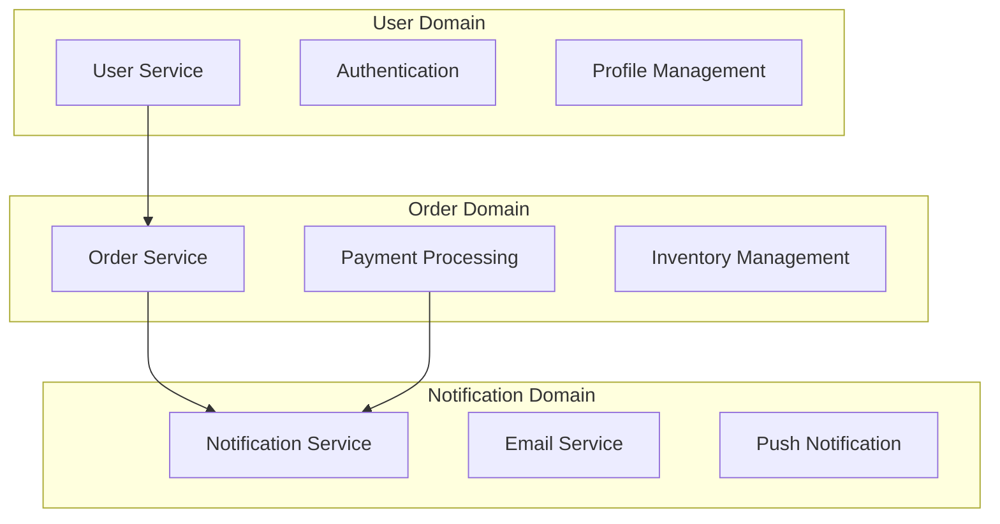

# 大規模開発テクニック

大規模プロジェクトでのClaude Code活用テクニックについて解説します。パフォーマンス最適化と保守性向上の実践的な手法を通じて、スケーラブルな開発体制を構築します。

## 概要

### 大規模開発の課題

大規模プロジェクトでは以下の課題が顕在化します：

- **複雑性の管理**: システム全体の理解が困難
- **チーム間の連携**: 複数チームでの一貫性確保
- **パフォーマンス**: 応答性とスループットの維持
- **保守性**: 長期的な変更容易性の確保
- **品質管理**: 大量のコードでの品質統一

### Claude Codeでの解決アプローチ

1. **モジュラー設計**: 独立性の高いコンポーネント設計
2. **自動化の活用**: 繰り返し作業の効率化
3. **知識の体系化**: 設計決定とパターンの文書化
4. **段階的最適化**: 継続的な改善プロセス
5. **チーム間連携**: 統一されたツールと手法

## 大規模開発アーキテクチャ

### システム分割戦略

#### 1. ドメイン駆動設計 (DDD) の適用



**Claude Code活用例**:
```markdown
# ドメインサービス生成プロンプト

以下の要件に基づいてドメインサービスを生成してください：

## ドメイン情報
- **ドメイン名**: [ドメイン名]
- **境界コンテキスト**: [境界の定義]
- **主要エンティティ**: [エンティティリスト]
- **ビジネスルール**: [重要なルール]

## アーキテクチャ制約
- Clean Architecture準拠
- 依存関係逆転原則の適用
- ドメインロジックの純粋性維持
- インフラストラクチャからの独立

## 生成対象
- ドメインエンティティ
- ドメインサービス
- リポジトリインターフェース
- ユースケース実装
- 単体テスト

期待する出力：
```typescript
// Domain Entity
export class User {
  constructor(
    private readonly id: UserId,
    private readonly email: Email,
    private readonly profile: UserProfile
  ) {}
  
  // ドメインロジック
  public changeEmail(newEmail: Email): void {
    // ビジネスルール検証
    this.validateEmailChange(newEmail);
    this.email = newEmail;
  }
}

// Domain Service
export class UserDomainService {
  constructor(
    private readonly userRepository: UserRepository
  ) {}
  
  public async createUser(userData: CreateUserData): Promise<User> {
    // 複雑なビジネスロジック
  }
}
```
```

#### 2. マイクロサービス分割

**サービス分割の原則**:
```markdown
## マイクロサービス分割ガイドライン

### 分割基準
1. **ビジネス機能**: 独立したビジネス価値を提供
2. **データ所有権**: 明確なデータ境界を持つ
3. **チーム構造**: 開発チームの責任範囲と一致
4. **変更頻度**: 変更パターンが類似している
5. **技術要件**: 異なる技術スタックが必要

### Claude Code活用パターン
```
以下の要件に基づいてマイクロサービスを設計してください：

## サービス要件
- **サービス名**: [サービス名]
- **責務**: [主要な責務]
- **データ**: [管理するデータ]
- **API**: [提供するAPI]
- **依存関係**: [他サービスとの関係]

## 技術制約
- Node.js + TypeScript
- RESTful API設計
- OpenAPI仕様準拠
- Docker対応
- 監視・ログ対応

## 生成対象
- サービス基盤コード
- API定義 (OpenAPI)
- データモデル
- 設定ファイル
- Dockerfile
- 監視設定
```
```

### 3. レイヤードアーキテクチャの最適化

#### 依存関係の管理

**依存関係注入パターン**:
```typescript
// Claude Code生成例
// 大規模システム用DIコンテナ設計

export interface Container {
  register<T>(token: Token<T>, factory: Factory<T>): void;
  resolve<T>(token: Token<T>): T;
  createScope(): Container;
}

export class DIContainer implements Container {
  private dependencies = new Map<Token<any>, Factory<any>>();
  private singletons = new Map<Token<any>, any>();
  
  register<T>(token: Token<T>, factory: Factory<T>): void {
    this.dependencies.set(token, factory);
  }
  
  resolve<T>(token: Token<T>): T {
    // 循環依存検出
    // スコープ管理
    // ライフサイクル管理
  }
}

// 使用例
const container = new DIContainer();

// サービス登録
container.register(UserRepository, () => new PostgresUserRepository());
container.register(UserService, (c) => new UserService(c.resolve(UserRepository)));

// 解決
const userService = container.resolve(UserService);
```

## パフォーマンス最適化テクニック

### 1. データベース最適化

#### クエリ最適化

**Claude Code活用例**:
```markdown
# データベースクエリ最適化プロンプト

以下のクエリをパフォーマンス最適化してください：

## 現在のクエリ
```sql
[最適化対象のクエリ]
```

## パフォーマンス要件
- 応答時間: 100ms以下
- 同時実行: 1000req/sec
- データ量: 100万レコード

## 最適化観点
- インデックス設計
- クエリ構造改善
- N+1問題解決
- キャッシュ戦略
- パーティショニング

期待する出力：
1. 最適化されたクエリ
2. 必要なインデックス定義
3. 実行計画の分析
4. パフォーマンステスト用クエリ
```

**生成例**:
```sql
-- 最適化前
SELECT u.*, p.*, o.*
FROM users u
LEFT JOIN profiles p ON u.id = p.user_id
LEFT JOIN orders o ON u.id = o.user_id
WHERE u.created_at > '2024-01-01';

-- 最適化後
-- 1. 必要なカラムのみ選択
-- 2. 適切なインデックス活用
-- 3. ページネーション対応
SELECT 
  u.id, u.email, u.created_at,
  p.display_name,
  COUNT(o.id) as order_count
FROM users u
LEFT JOIN profiles p ON u.id = p.user_id
LEFT JOIN orders o ON u.id = o.user_id
WHERE u.created_at > '2024-01-01'
  AND u.id > :last_id  -- カーソルベースページネーション
GROUP BY u.id, u.email, u.created_at, p.display_name
ORDER BY u.id
LIMIT 50;

-- 必要なインデックス
CREATE INDEX CONCURRENTLY idx_users_created_at_id 
ON users (created_at, id);

CREATE INDEX CONCURRENTLY idx_profiles_user_id 
ON profiles (user_id);

CREATE INDEX CONCURRENTLY idx_orders_user_id 
ON orders (user_id);
```

#### キャッシュ戦略

**多層キャッシュ設計**:
```typescript
// Claude Code生成例
export interface CacheStrategy {
  get<T>(key: string): Promise<T | null>;
  set<T>(key: string, value: T, ttl?: number): Promise<void>;
  invalidate(pattern: string): Promise<void>;
}

export class MultiLayerCache implements CacheStrategy {
  constructor(
    private readonly l1Cache: MemoryCache,    // アプリケーション内メモリ
    private readonly l2Cache: RedisCache,     // 分散キャッシュ
    private readonly l3Cache: DatabaseCache   // データベースキャッシュ
  ) {}
  
  async get<T>(key: string): Promise<T | null> {
    // L1キャッシュから取得試行
    let value = await this.l1Cache.get<T>(key);
    if (value !== null) {
      return value;
    }
    
    // L2キャッシュから取得試行
    value = await this.l2Cache.get<T>(key);
    if (value !== null) {
      // L1キャッシュに昇格
      await this.l1Cache.set(key, value, 300); // 5分
      return value;
    }
    
    // L3キャッシュから取得試行
    value = await this.l3Cache.get<T>(key);
    if (value !== null) {
      // 上位キャッシュに昇格
      await this.l2Cache.set(key, value, 1800); // 30分
      await this.l1Cache.set(key, value, 300);  // 5分
      return value;
    }
    
    return null;
  }
  
  async set<T>(key: string, value: T, ttl = 3600): Promise<void> {
    // 全レイヤーに設定
    await Promise.all([
      this.l1Cache.set(key, value, Math.min(ttl, 300)),
      this.l2Cache.set(key, value, Math.min(ttl, 1800)),
      this.l3Cache.set(key, value, ttl)
    ]);
  }
}
```

### 2. フロントエンド最適化

#### バンドル最適化

**Claude Code活用例**:
```markdown
# Webpack設定最適化プロンプト

大規模Reactアプリケーション用のWebpack設定を最適化してください：

## 現在の状況
- バンドルサイズ: 5MB
- 初回読み込み時間: 8秒
- ページ数: 50+
- コンポーネント数: 500+

## 最適化目標
- バンドルサイズ: 2MB以下
- 初回読み込み: 3秒以下
- Code Splitting適用
- Tree Shaking最適化

## 技術スタック
- React 18
- TypeScript
- Material-UI
- React Router

期待する出力：
1. 最適化されたwebpack.config.js
2. Code Splitting戦略
3. 動的インポート実装例
4. バンドル分析設定
```

**生成例**:
```javascript
// webpack.config.js
const path = require('path');
const { BundleAnalyzerPlugin } = require('webpack-bundle-analyzer');

module.exports = {
  entry: {
    main: './src/index.tsx',
    vendor: ['react', 'react-dom', 'react-router-dom']
  },
  
  optimization: {
    splitChunks: {
      chunks: 'all',
      cacheGroups: {
        // ベンダーライブラリ
        vendor: {
          test: /[\\/]node_modules[\\/]/,
          name: 'vendors',
          chunks: 'all',
          priority: 10
        },
        // 共通コンポーネント
        common: {
          name: 'common',
          minChunks: 2,
          chunks: 'all',
          priority: 5,
          reuseExistingChunk: true
        },
        // 大きなライブラリを個別分割
        mui: {
          test: /[\\/]node_modules[\\/]@mui[\\/]/,
          name: 'mui',
          chunks: 'all',
          priority: 15
        }
      }
    },
    // Tree Shaking最適化
    usedExports: true,
    sideEffects: false
  },
  
  plugins: [
    // バンドル分析
    new BundleAnalyzerPlugin({
      analyzerMode: process.env.ANALYZE ? 'server' : 'disabled'
    })
  ]
};

// 動的インポート実装例
const LazyDashboard = React.lazy(() => 
  import('./pages/Dashboard').then(module => ({
    default: module.Dashboard
  }))
);

const LazyUserManagement = React.lazy(() => 
  import('./pages/UserManagement')
);

// ルート設定
const AppRoutes = () => (
  <Suspense fallback={<LoadingSpinner />}>
    <Routes>
      <Route path="/dashboard" element={<LazyDashboard />} />
      <Route path="/users" element={<LazyUserManagement />} />
    </Routes>
  </Suspense>
);
```

#### 状態管理最適化

**大規模状態管理パターン**:
```typescript
// Claude Code生成例
// 大規模アプリケーション用状態管理

// ドメイン別状態分割
export interface AppState {
  user: UserState;
  orders: OrderState;
  products: ProductState;
  ui: UIState;
}

// 状態スライス定義
export interface UserState {
  currentUser: User | null;
  users: Record<string, User>;
  loading: boolean;
  error: string | null;
}

// 最適化されたセレクター
export const userSelectors = {
  // メモ化されたセレクター
  getCurrentUser: (state: AppState) => state.user.currentUser,
  
  // 複雑な計算のメモ化
  getUsersByRole: createSelector(
    (state: AppState) => state.user.users,
    (users) => {
      const result: Record<string, User[]> = {};
      Object.values(users).forEach(user => {
        if (!result[user.role]) {
          result[user.role] = [];
        }
        result[user.role].push(user);
      });
      return result;
    }
  ),
  
  // パフォーマンス最適化されたフィルタリング
  getActiveUsers: createSelector(
    (state: AppState) => state.user.users,
    (users) => Object.values(users).filter(user => user.isActive)
  )
};

// 非同期アクション最適化
export const userActions = {
  // バッチ処理
  fetchUsersInBatch: (userIds: string[]) => async (dispatch: Dispatch) => {
    const BATCH_SIZE = 50;
    const batches = chunk(userIds, BATCH_SIZE);
    
    for (const batch of batches) {
      await dispatch(fetchUsersBatch(batch));
      // バッチ間の間隔を設ける
      await new Promise(resolve => setTimeout(resolve, 100));
    }
  },
  
  // 楽観的更新
  updateUserOptimistic: (userId: string, updates: Partial<User>) => 
    async (dispatch: Dispatch, getState: () => AppState) => {
      // 楽観的更新
      dispatch(updateUserLocal(userId, updates));
      
      try {
        const result = await userAPI.updateUser(userId, updates);
        dispatch(updateUserSuccess(userId, result));
      } catch (error) {
        // ロールバック
        const currentState = getState();
        const originalUser = currentState.user.users[userId];
        dispatch(updateUserLocal(userId, originalUser));
        dispatch(updateUserError(error.message));
      }
    }
};
```

## 保守性向上テクニック

### 1. コード品質管理

#### 自動化されたコード品質チェック

**Claude Code活用例**:
```markdown
# コード品質チェック設定生成プロンプト

大規模TypeScriptプロジェクト用の包括的なコード品質チェック設定を生成してください：

## プロジェクト情報
- 言語: TypeScript
- フレームワーク: React, Node.js
- チームサイズ: 20人
- コードベース: 100,000行+

## 品質要件
- 型安全性: strict mode
- テストカバレッジ: 80%以上
- 複雑度制限: 10以下
- 重複コード: 5%以下
- セキュリティ: 脆弱性ゼロ

## ツール統合
- ESLint
- Prettier
- SonarQube
- Husky
- lint-staged

期待する出力：
1. ESLint設定ファイル
2. Prettier設定
3. Git hooks設定
4. CI/CD統合設定
5. 品質ゲート定義
```

**生成例**:
```javascript
// .eslintrc.js
module.exports = {
  extends: [
    '@typescript-eslint/recommended',
    '@typescript-eslint/recommended-requiring-type-checking',
    'plugin:react/recommended',
    'plugin:react-hooks/recommended',
    'plugin:security/recommended'
  ],
  
  rules: {
    // 複雑度制限
    'complexity': ['error', { max: 10 }],
    'max-depth': ['error', 4],
    'max-lines-per-function': ['error', { max: 50 }],
    
    // TypeScript厳格化
    '@typescript-eslint/no-explicit-any': 'error',
    '@typescript-eslint/no-unsafe-assignment': 'error',
    '@typescript-eslint/no-unsafe-call': 'error',
    
    // React最適化
    'react/jsx-key': 'error',
    'react/no-array-index-key': 'warn',
    'react-hooks/exhaustive-deps': 'error',
    
    // セキュリティ
    'security/detect-object-injection': 'error',
    'security/detect-non-literal-regexp': 'error'
  },
  
  overrides: [
    {
      files: ['**/*.test.ts', '**/*.test.tsx'],
      rules: {
        // テストファイルでは一部ルールを緩和
        '@typescript-eslint/no-explicit-any': 'off',
        'max-lines-per-function': 'off'
      }
    }
  ]
};

// package.json scripts
{
  "scripts": {
    "lint": "eslint src --ext .ts,.tsx --max-warnings 0",
    "lint:fix": "eslint src --ext .ts,.tsx --fix",
    "type-check": "tsc --noEmit",
    "quality-check": "npm run lint && npm run type-check && npm run test:coverage",
    "pre-commit": "lint-staged"
  },
  "lint-staged": {
    "*.{ts,tsx}": [
      "eslint --fix",
      "prettier --write",
      "git add"
    ]
  }
}

// .github/workflows/quality-check.yml
name: Quality Check

on: [push, pull_request]

jobs:
  quality:
    runs-on: ubuntu-latest
    steps:
      - uses: actions/checkout@v3
      - uses: actions/setup-node@v3
        with:
          node-version: '18'
          cache: 'npm'
      
      - run: npm ci
      - run: npm run quality-check
      
      - name: SonarQube Scan
        uses: sonarqube-quality-gate-action@master
        env:
          SONAR_TOKEN: ${{ secrets.SONAR_TOKEN }}
```

### 2. ドキュメント自動生成

#### API ドキュメント自動生成

**Claude Code活用例**:
```markdown
# API ドキュメント自動生成設定

TypeScriptコードからOpenAPI仕様を自動生成する設定を作成してください：

## 要件
- Express + TypeScript API
- OpenAPI 3.0仕様
- 型安全性保証
- 自動更新機能
- インタラクティブUI

## 生成対象
- OpenAPI仕様ファイル
- Swagger UI設定
- 型定義ファイル
- クライアントSDK

期待する出力：
1. 自動生成設定
2. デコレーター定義
3. ビルドスクリプト
4. CI/CD統合
```

**生成例**:
```typescript
// API定義デコレーター
import { OpenAPIV3 } from 'openapi-types';

export function ApiEndpoint(spec: {
  summary: string;
  description?: string;
  tags?: string[];
  responses: Record<string, OpenAPIV3.ResponseObject>;
}) {
  return function (target: any, propertyKey: string, descriptor: PropertyDescriptor) {
    // メタデータ保存
    Reflect.defineMetadata('api:spec', spec, target, propertyKey);
  };
}

export function ApiParam(spec: {
  name: string;
  description?: string;
  required?: boolean;
  schema: OpenAPIV3.SchemaObject;
}) {
  return function (target: any, propertyKey: string, parameterIndex: number) {
    const existingParams = Reflect.getMetadata('api:params', target, propertyKey) || [];
    existingParams[parameterIndex] = spec;
    Reflect.defineMetadata('api:params', existingParams, target, propertyKey);
  };
}

// 使用例
export class UserController {
  @ApiEndpoint({
    summary: 'ユーザー一覧取得',
    description: 'ページネーション対応のユーザー一覧を取得',
    tags: ['users'],
    responses: {
      '200': {
        description: 'ユーザー一覧',
        content: {
          'application/json': {
            schema: {
              type: 'object',
              properties: {
                users: {
                  type: 'array',
                  items: { $ref: '#/components/schemas/User' }
                },
                pagination: { $ref: '#/components/schemas/Pagination' }
              }
            }
          }
        }
      }
    }
  })
  async getUsers(
    @ApiParam({
      name: 'page',
      description: 'ページ番号',
      required: false,
      schema: { type: 'integer', minimum: 1, default: 1 }
    })
    page: number = 1,
    
    @ApiParam({
      name: 'limit',
      description: '1ページあたりの件数',
      required: false,
      schema: { type: 'integer', minimum: 1, maximum: 100, default: 20 }
    })
    limit: number = 20
  ): Promise<{ users: User[]; pagination: Pagination }> {
    // 実装
  }
}

// 自動生成スクリプト
import { generateOpenAPISpec } from './openapi-generator';

async function generateDocs() {
  const spec = await generateOpenAPISpec({
    controllers: ['./src/controllers/**/*.ts'],
    models: ['./src/models/**/*.ts'],
    output: './docs/api-spec.json'
  });
  
  // Swagger UI生成
  await generateSwaggerUI(spec, './docs/swagger-ui');
  
  // クライアントSDK生成
  await generateClientSDK(spec, './generated/client');
}

generateDocs().catch(console.error);
```

### 3. 監視とログ

#### 分散トレーシング

**Claude Code活用例**:
```typescript
// 分散トレーシング実装
import { trace, context, SpanStatusCode } from '@opentelemetry/api';

export class TracingService {
  private tracer = trace.getTracer('app-service');
  
  async traceAsyncOperation<T>(
    operationName: string,
    operation: () => Promise<T>,
    attributes?: Record<string, string | number>
  ): Promise<T> {
    const span = this.tracer.startSpan(operationName, {
      attributes: {
        'service.name': 'user-service',
        'service.version': '1.0.0',
        ...attributes
      }
    });
    
    return context.with(trace.setSpan(context.active(), span), async () => {
      try {
        const result = await operation();
        span.setStatus({ code: SpanStatusCode.OK });
        return result;
      } catch (error) {
        span.setStatus({
          code: SpanStatusCode.ERROR,
          message: error.message
        });
        span.recordException(error);
        throw error;
      } finally {
        span.end();
      }
    });
  }
}

// 使用例
export class UserService {
  constructor(
    private readonly userRepository: UserRepository,
    private readonly tracing: TracingService
  ) {}
  
  async createUser(userData: CreateUserData): Promise<User> {
    return this.tracing.traceAsyncOperation(
      'user.create',
      async () => {
        // ビジネスロジック
        const user = await this.userRepository.create(userData);
        
        // 関連処理のトレース
        await this.tracing.traceAsyncOperation(
          'user.send_welcome_email',
          () => this.emailService.sendWelcomeEmail(user.email),
          { 'user.id': user.id, 'email.type': 'welcome' }
        );
        
        return user;
      },
      { 'user.email': userData.email }
    );
  }
}
```

## チーム間連携テクニック

### 1. API契約管理

#### Contract-First開発

**Claude Code活用例**:
```markdown
# API契約定義プロンプト

マイクロサービス間のAPI契約を定義してください：

## サービス情報
- **提供サービス**: User Service
- **消費サービス**: Order Service, Notification Service
- **契約内容**: ユーザー情報取得、ユーザー状態更新

## 契約要件
- バージョニング戦略
- 後方互換性保証
- エラーハンドリング統一
- レート制限対応

## 技術制約
- OpenAPI 3.0
- JSON Schema検証
- 自動テスト生成
- モック生成対応

期待する出力：
1. OpenAPI仕様定義
2. 契約テスト実装
3. モックサーバー設定
4. バージョニング戦略
```

**生成例**:
```yaml
# user-service-api.yaml
openapi: 3.0.3
info:
  title: User Service API
  version: 2.1.0
  description: ユーザー管理サービスAPI

paths:
  /api/v2/users/{userId}:
    get:
      summary: ユーザー情報取得
      parameters:
        - name: userId
          in: path
          required: true
          schema:
            type: string
            format: uuid
      responses:
        '200':
          description: ユーザー情報
          content:
            application/json:
              schema:
                $ref: '#/components/schemas/User'
        '404':
          description: ユーザーが見つかりません
          content:
            application/json:
              schema:
                $ref: '#/components/schemas/Error'

components:
  schemas:
    User:
      type: object
      required: [id, email, status]
      properties:
        id:
          type: string
          format: uuid
        email:
          type: string
          format: email
        status:
          type: string
          enum: [active, inactive, suspended]
        profile:
          $ref: '#/components/schemas/UserProfile'
    
    UserProfile:
      type: object
      properties:
        displayName:
          type: string
          maxLength: 100
        avatar:
          type: string
          format: uri
    
    Error:
      type: object
      required: [code, message]
      properties:
        code:
          type: string
        message:
          type: string
        details:
          type: object
```

```typescript
// 契約テスト実装
import { Pact } from '@pact-foundation/pact';

describe('User Service Contract', () => {
  const provider = new Pact({
    consumer: 'Order Service',
    provider: 'User Service',
    port: 1234
  });

  beforeAll(() => provider.setup());
  afterAll(() => provider.finalize());

  describe('GET /api/v2/users/{userId}', () => {
    it('should return user when user exists', async () => {
      // 契約定義
      await provider.addInteraction({
        state: 'user with id 123 exists',
        uponReceiving: 'a request for user 123',
        withRequest: {
          method: 'GET',
          path: '/api/v2/users/123',
          headers: {
            'Accept': 'application/json'
          }
        },
        willRespondWith: {
          status: 200,
          headers: {
            'Content-Type': 'application/json'
          },
          body: {
            id: '123',
            email: 'user@example.com',
            status: 'active',
            profile: {
              displayName: 'Test User'
            }
          }
        }
      });

      // テスト実行
      const response = await fetch(`${provider.mockService.baseUrl}/api/v2/users/123`);
      const user = await response.json();
      
      expect(response.status).toBe(200);
      expect(user.id).toBe('123');
      expect(user.email).toBe('user@example.com');
    });
  });
});
```

### 2. 統合テスト戦略

#### エンドツーエンドテスト

**Claude Code活用例**:
```typescript
// 大規模システム用E2Eテスト
import { test, expect } from '@playwright/test';

export class E2ETestFramework {
  constructor(private page: Page) {}
  
  // ページオブジェクトパターン
  async navigateToUserManagement() {
    await this.page.goto('/admin/users');
    await this.page.waitForSelector('[data-testid="user-list"]');
  }
  
  async createUser(userData: {
    email: string;
    displayName: string;
    role: string;
  }) {
    await this.page.click('[data-testid="create-user-button"]');
    await this.page.fill('[data-testid="email-input"]', userData.email);
    await this.page.fill('[data-testid="display-name-input"]', userData.displayName);
    await this.page.selectOption('[data-testid="role-select"]', userData.role);
    await this.page.click('[data-testid="submit-button"]');
    
    // 成功メッセージの確認
    await expect(this.page.locator('[data-testid="success-message"]')).toBeVisible();
  }
  
  async verifyUserInList(email: string) {
    const userRow = this.page.locator(`[data-testid="user-row"][data-email="${email}"]`);
    await expect(userRow).toBeVisible();
    return userRow;
  }
}

// テストシナリオ
test.describe('User Management E2E', () => {
  let framework: E2ETestFramework;
  
  test.beforeEach(async ({ page }) => {
    framework = new E2ETestFramework(page);
    
    // テストデータのセットアップ
    await test.step('Setup test data', async () => {
      await page.request.post('/api/test/setup', {
        data: { scenario: 'user-management' }
      });
    });
  });
  
  test('should create and manage users', async () => {
    await test.step('Navigate to user management', async () => {
      await framework.navigateToUserManagement();
    });
    
    await test.step('Create new user', async () => {
      await framework.createUser({
        email: 'test@example.com',
        displayName: 'Test User',
        role: 'user'
      });
    });
    
    await test.step('Verify user appears in list', async () => {
      const userRow = await framework.verifyUserInList('test@example.com');
      await expect(userRow.locator('[data-testid="user-status"]')).toHaveText('Active');
    });
    
    await test.step('Update user role', async () => {
      const userRow = await framework.verifyUserInList('test@example.com');
      await userRow.locator('[data-testid="edit-button"]').click();
      await framework.page.selectOption('[data-testid="role-select"]', 'admin');
      await framework.page.click('[data-testid="save-button"]');
    });
    
    await test.step('Verify role update', async () => {
      const userRow = await framework.verifyUserInList('test@example.com');
      await expect(userRow.locator('[data-testid="user-role"]')).toHaveText('Admin');
    });
  });
  
  test.afterEach(async ({ page }) => {
    // テストデータのクリーンアップ
    await page.request.post('/api/test/cleanup');
  });
});
```

## 継続的改善プロセス

### 1. メトリクス収集と分析

#### パフォーマンスメトリクス

**Claude Code活用例**:
```typescript
// パフォーマンス監視システム
export class PerformanceMonitor {
  private metrics = new Map<string, PerformanceMetric[]>();
  
  async measureOperation<T>(
    operationName: string,
    operation: () => Promise<T>
  ): Promise<T> {
    const startTime = performance.now();
    const startMemory = process.memoryUsage();
    
    try {
      const result = await operation();
      
      const endTime = performance.now();
      const endMemory = process.memoryUsage();
      
      this.recordMetric({
        name: operationName,
        duration: endTime - startTime,
        memoryDelta: endMemory.heapUsed - startMemory.heapUsed,
        timestamp: new Date(),
        success: true
      });
      
      return result;
    } catch (error) {
      this.recordMetric({
        name: operationName,
        duration: performance.now() - startTime,
        timestamp: new Date(),
        success: false,
        error: error.message
      });
      throw error;
    }
  }
  
  private recordMetric(metric: PerformanceMetric) {
    if (!this.metrics.has(metric.name)) {
      this.metrics.set(metric.name, []);
    }
    
    const metrics = this.metrics.get(metric.name)!;
    metrics.push(metric);
    
    // 古いメトリクスの削除（メモリ使用量制限）
    if (metrics.length > 1000) {
      metrics.splice(0, metrics.length - 1000);
    }
    
    // 異常値の検出
    this.detectAnomalies(metric.name, metric);
  }
  
  private detectAnomalies(operationName: string, currentMetric: PerformanceMetric) {
    const metrics = this.metrics.get(operationName)!;
    if (metrics.length < 10) return; // 十分なデータがない
    
    const recentMetrics = metrics.slice(-10);
    const avgDuration = recentMetrics.reduce((sum, m) => sum + m.duration, 0) / recentMetrics.length;
    const threshold = avgDuration * 2; // 平均の2倍を閾値とする
    
    if (currentMetric.duration > threshold) {
      this.alertSlowOperation(operationName, currentMetric, avgDuration);
    }
  }
  
  private alertSlowOperation(
    operationName: string,
    metric: PerformanceMetric,
    avgDuration: number
  ) {
    console.warn(`🐌 Slow operation detected: ${operationName}`, {
      currentDuration: metric.duration,
      averageDuration: avgDuration,
      threshold: avgDuration * 2
    });
    
    // アラート送信（Slack、メールなど）
    this.sendAlert({
      type: 'performance',
      severity: 'warning',
      operation: operationName,
      details: {
        duration: metric.duration,
        average: avgDuration
      }
    });
  }
}

interface PerformanceMetric {
  name: string;
  duration: number;
  memoryDelta?: number;
  timestamp: Date;
  success: boolean;
  error?: string;
}
```

### 2. 自動化された改善提案

#### コード品質改善

**Claude Code活用例**:
```markdown
# コード品質改善提案プロンプト

以下のメトリクスに基づいて、コード品質改善提案を生成してください：

## 現在のメトリクス
- 循環的複雑度: 平均12 (目標: 10以下)
- テストカバレッジ: 65% (目標: 80%以上)
- 重複コード: 8% (目標: 5%以下)
- 技術的負債: 高 (SonarQube評価)

## 問題のあるファイル
1. UserService.ts - 複雑度18
2. OrderController.ts - カバレッジ30%
3. PaymentProcessor.ts - 重複コード多数

## 制約条件
- 既存APIの互換性維持
- 段階的な改善（一度に大きな変更は避ける）
- チームの学習コストを考慮

期待する出力：
1. 優先度付きの改善計画
2. 具体的なリファクタリング手順
3. 改善後の期待メトリクス
4. 実装時の注意点
```

**生成例**:
```markdown
# コード品質改善計画

## 優先度1: UserService.ts の複雑度削減

### 現状分析
- 循環的複雑度: 18
- 主な問題: 1つのメソッドに複数の責務が集中

### 改善手順
1. **メソッド分割** (工数: 4時間)
   ```typescript
   // Before
   async createUser(userData: CreateUserData): Promise<User> {
     // バリデーション (複雑度: 5)
     if (!userData.email || !isValidEmail(userData.email)) {
       throw new Error('Invalid email');
     }
     if (!userData.password || userData.password.length < 8) {
       throw new Error('Password too short');
     }
     
     // 重複チェック (複雑度: 3)
     const existingUser = await this.userRepository.findByEmail(userData.email);
     if (existingUser) {
       throw new Error('User already exists');
     }
     
     // パスワードハッシュ化 (複雑度: 2)
     const hashedPassword = await bcrypt.hash(userData.password, 10);
     
     // ユーザー作成 (複雑度: 4)
     const user = await this.userRepository.create({
       ...userData,
       password: hashedPassword
     });
     
     // 通知送信 (複雑度: 4)
     try {
       await this.emailService.sendWelcomeEmail(user.email);
     } catch (error) {
       console.error('Failed to send welcome email', error);
     }
     
     return user;
   }
   
   // After
   async createUser(userData: CreateUserData): Promise<User> {
     await this.validateUserData(userData);
     await this.checkUserExists(userData.email);
     
     const hashedPassword = await this.hashPassword(userData.password);
     const user = await this.saveUser({ ...userData, password: hashedPassword });
     
     // 非同期で通知送信（メイン処理をブロックしない）
     this.sendWelcomeEmailAsync(user.email);
     
     return user;
   }
   
   private async validateUserData(userData: CreateUserData): Promise<void> {
     // バリデーションロジック (複雑度: 3)
   }
   
   private async checkUserExists(email: string): Promise<void> {
     // 重複チェックロジック (複雑度: 2)
   }
   
   private async hashPassword(password: string): Promise<string> {
     // パスワードハッシュ化 (複雑度: 1)
   }
   
   private async saveUser(userData: CreateUserData): Promise<User> {
     // ユーザー保存ロジック (複雑度: 2)
   }
   ```

2. **バリデーション層の分離** (工数: 2時間)
   ```typescript
   export class UserValidator {
     static validateCreateUserData(userData: CreateUserData): ValidationResult {
       const errors: string[] = [];
       
       if (!userData.email || !this.isValidEmail(userData.email)) {
         errors.push('Invalid email format');
       }
       
       if (!userData.password || userData.password.length < 8) {
         errors.push('Password must be at least 8 characters');
       }
       
       return {
         isValid: errors.length === 0,
         errors
       };
     }
   }
   ```

### 期待される改善
- 複雑度: 18 → 6 (各メソッド平均2)
- テスタビリティ: 向上（各メソッドを個別テスト可能）
- 保守性: 向上（責務の明確化）

## 優先度2: OrderController.ts のテストカバレッジ向上

### 現状分析
- カバレッジ: 30%
- 未テスト箇所: エラーハンドリング、エッジケース

### 改善手順
1. **テストケース追加** (工数: 6時間)
   ```typescript
   describe('OrderController', () => {
     describe('createOrder', () => {
       it('should create order successfully', async () => {
         // 正常系テスト
       });
       
       it('should handle invalid product ID', async () => {
         // エラーハンドリングテスト
       });
       
       it('should handle insufficient inventory', async () => {
         // ビジネスルール違反テスト
       });
       
       it('should handle payment failure', async () => {
         // 外部サービス連携エラーテスト
       });
     });
   });
   ```

### 期待される改善
- カバレッジ: 30% → 85%
- バグ検出率: 向上
- リグレッション防止: 強化

## 実装スケジュール

### Week 1
- [ ] UserService.ts リファクタリング
- [ ] 単体テスト更新

### Week 2
- [ ] OrderController.ts テスト追加
- [ ] 統合テスト実行

### Week 3
- [ ] PaymentProcessor.ts 重複コード削除
- [ ] 全体テスト実行

### Week 4
- [ ] メトリクス測定
- [ ] 改善効果の評価
```

## まとめ

大規模開発でのClaude Code活用は、以下の要素を組み合わせることで効果を最大化できます：

### 技術的要素
1. **アーキテクチャ設計**: モジュラー設計とマイクロサービス分割
2. **パフォーマンス最適化**: データベース、フロントエンド、キャッシュ戦略
3. **品質管理**: 自動化されたテストとコード品質チェック
4. **監視**: 分散トレーシングとメトリクス収集

### 組織的要素
1. **チーム連携**: API契約管理と統合テスト
2. **知識共有**: ドキュメント自動生成と継続的学習
3. **プロセス改善**: メトリクス分析と自動化された改善提案

### 継続的改善
1. **定期的な評価**: パフォーマンスと品質メトリクスの監視
2. **段階的最適化**: 小さな改善の積み重ね
3. **学習文化**: チーム全体でのスキル向上

これらの手法を組み合わせることで、大規模プロジェクトでも効率的で保守性の高い開発を実現できます。

---

**関連ドキュメント:**
- [共有コンテキスト管理](03-shared-context.md) - チーム知識の共有システム
- [チーム開発セットアップ](01-team-setup.md) - 基本的な環境構築
- [体系的な開発プロセス](../06-development-process/README.md) - 開発プロセスの詳細