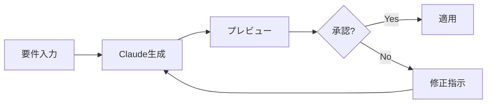

# IDE統合ガイド

Claude CodeをVS Code、Cursor、その他の開発環境と統合して、より効率的な開発ワークフローを実現する方法を説明します。

## 対応IDE一覧

### 公式サポート

1. **Visual Studio Code**
   - MCP (Model Context Protocol) 拡張機能
   - 直接統合
   - カスタムコマンド

2. **Cursor**
   - ネイティブ統合
   - AIファースト設計
   - シームレスな体験

3. **JetBrains IDEs**
   - IntelliJ IDEA
   - WebStorm
   - PyCharm
   - プラグイン経由

### コミュニティサポート

- Sublime Text
- Vim/Neovim
- Emacs
- Atom

## Visual Studio Code統合

### MCPプロトコルのセットアップ

1. **拡張機能のインストール**

```bash
# VS Code拡張機能マーケットプレイスから
code --install-extension anthropic.claude-code-mcp
```

2. **設定ファイルの作成**

`.vscode/claude.json`:
```json
{
  "claude": {
    "mcp": {
      "enabled": true,
      "servers": [
        {
          "name": "project-context",
          "command": "claude-mcp-server",
          "args": ["--project", "${workspaceFolder}"]
        }
      ]
    },
    "memory": {
      "autoLoad": true,
      "searchPaths": [".", "..", "../.."]
    }
  }
}
```

3. **キーバインディングの設定**

`keybindings.json`:
```json
[
  {
    "key": "ctrl+shift+c",
    "command": "claude.openChat"
  },
  {
    "key": "ctrl+shift+r",
    "command": "claude.refactor"
  },
  {
    "key": "ctrl+shift+e",
    "command": "claude.explain"
  }
]
```

### VS Code コマンドパレット

利用可能なコマンド：

- `Claude: Open Chat` - チャットウィンドウを開く
- `Claude: Explain Code` - 選択したコードの説明
- `Claude: Generate Code` - コード生成
- `Claude: Refactor` - リファクタリング提案
- `Claude: Fix Error` - エラー修正
- `Claude: Write Tests` - テスト生成

### コンテキストメニュー統合

右クリックメニューから直接アクセス：

```
選択したコード上で右クリック
├── Claude で説明
├── Claude でリファクタリング
├── Claude でテスト作成
└── Claude で最適化
```

## Cursor統合

### ネイティブ統合の設定

Cursorは Claude をネイティブサポート：

1. **設定を開く**
   - `Cmd/Ctrl + ,` で設定を開く
   - "AI" セクションに移動

2. **Claude を選択**
```
AI Provider: Claude
Model: Claude 3 Opus
```

3. **ショートカット**
   - `Cmd/Ctrl + K`: インライン編集
   - `Cmd/Ctrl + L`: チャット開始
   - `Cmd/Ctrl + Shift + L`: コンテキスト付きチャット

### Cursor特有の機能

#### インライン編集

```typescript
// カーソルを置いて Cmd+K を押す
function calculateTotal(items) {
  // "Add TypeScript types and calculate with tax"
}
```

#### コンテキスト認識

Cursorは自動的に関連ファイルを検出：
- インポートされているファイル
- 同じディレクトリのファイル
- 最近編集したファイル

## JetBrains IDE統合

### プラグインのインストール

1. **Settings/Preferences を開く**
2. **Plugins > Marketplace**
3. **"Claude Code"** を検索
4. **Install** をクリック

### 設定

`claude.xml`:
```xml
<component name="ClaudeCodeSettings">
  <option name="apiEndpoint" value="https://api.anthropic.com" />
  <option name="contextDepth" value="5" />
  <option name="autoSuggest" value="true" />
  <option name="memoryPath" value="$PROJECT_DIR$/CLAUDE.md" />
</component>
```

### ツールウィンドウ

- **View > Tool Windows > Claude**
- サイドパネルでチャット
- フローティングウィンドウオプション

## MCP (Model Context Protocol)

### MCPとは

MCPは、AIモデルとIDEの間で構造化されたコンテキスト情報を交換するためのプロトコルです。

### MCPサーバーの実装

`mcp-server.js`:
```javascript
const { MCPServer } = require('@anthropic/mcp');

class ProjectContextServer extends MCPServer {
  async getContext(request) {
    return {
      project: {
        name: this.projectName,
        type: await this.detectProjectType(),
        dependencies: await this.getDependencies(),
        structure: await this.getProjectStructure()
      },
      files: {
        recent: await this.getRecentFiles(),
        related: await this.getRelatedFiles(request.currentFile)
      },
      git: {
        branch: await this.getCurrentBranch(),
        changes: await this.getUncommittedChanges()
      }
    };
  }

  async handleRequest(request) {
    switch (request.method) {
      case 'getContext':
        return this.getContext(request);
      case 'analyzeCode':
        return this.analyzeCode(request);
      case 'suggestRefactoring':
        return this.suggestRefactoring(request);
    }
  }
}
```

### カスタムMCPツール

`tools/custom-analyzer.js`:
```javascript
module.exports = {
  name: 'custom-analyzer',
  description: 'プロジェクト固有の分析ツール',
  
  async execute(context, params) {
    const { filePath, analysisType } = params;
    
    // カスタム分析ロジック
    const results = await this.analyze(filePath, analysisType);
    
    return {
      status: 'success',
      results: results,
      suggestions: this.generateSuggestions(results)
    };
  }
};
```

## ワークフロー最適化

### 1. コード生成ワークフロー



### 2. レビューワークフロー

1. **自動レビュートリガー**
```json
{
  "claude.review": {
    "triggers": {
      "onSave": true,
      "onCommit": true,
      "filePatterns": ["*.ts", "*.tsx"]
    }
  }
}
```

2. **レビュー結果の表示**
- インライン警告
- 問題パネル統合
- Quick Fix提案

### 3. テスト駆動開発

```typescript
// 1. テストを先に書く
describe('UserService', () => {
  it('should create user with valid data', async () => {
    // Claude: この���ストに対応する実装を生成
  });
});

// 2. Claudeが実装を生成
// 3. テストが通ることを確認
```

## カスタマイズ

### スニペット定義

`.vscode/claude-snippets.json`:
```json
{
  "React Component": {
    "prefix": "claude-component",
    "body": [
      "// Claude: Generate a React functional component",
      "// Props: ${1:props}",
      "// Features: ${2:features}"
    ]
  },
  "API Endpoint": {
    "prefix": "claude-api",
    "body": [
      "// Claude: Create ${1:GET} endpoint",
      "// Path: ${2:/api/resource}",
      "// Auth: ${3:required}"
    ]
  }
}
```

### カスタムコマンド

`.vscode/tasks.json`:
```json
{
  "version": "2.0.0",
  "tasks": [
    {
      "label": "Claude: Optimize Imports",
      "type": "shell",
      "command": "claude",
      "args": [
        "--command",
        "optimize imports in ${file}"
      ]
    },
    {
      "label": "Claude: Generate Documentation",
      "type": "shell",
      "command": "claude",
        "args": [
        "generate docs for ${file}"
      ]
    }
  ]
}
```

## トラブルシューティング

### 接続の問題

1. **MCPサーバーが起動しない**
```bash
# ログを確認
tail -f ~/.claude/mcp-server.log

# 手動起動
claude-mcp-server --debug
```

2. **認証エラー**
```bash
# APIキーの確認
claude auth status

# 再認証
claude auth login
```

### パフォーマンス問題

1. **レスポンスが遅い**
- コンテキストサイズを調整
- キャッシュを有効化
- 不要なファイルを除外

2. **メモリ使用量が多い**
```json
{
  "claude.performance": {
    "maxContextSize": 50000,
    "cacheEnabled": true,
    "excludePatterns": [
      "node_modules/**",
      "dist/**",
      "*.log"
    ]
  }
}
```

## ベストプラクティス

### 1. プロジェクト設定の共有

`.claude/ide-config.json`:
```json
{
  "team": {
    "codeStyle": "airbnb",
    "testFramework": "jest",
    "reviewChecklist": [
      "型安全性",
      "エラーハンドリング",
      "テストカバレッジ"
    ]
  }
}
```

### 2. 効率的なコンテキスト管理

- 関連ファイルのみを含める
- 大きなファイルは要約を使用
- 定期的にコンテキストをクリア

### 3. セキュリティ考慮

- APIキーは環境変数で管理
- 機密情報を含むファイルは除外
- チーム設定は別途管理

---

**ナビゲーション:**
- ⬅️ 前へ: [上級者向けトピック](10-advanced-topics.md) - 高度な活用テクニック
- ➡️ 次へ: [設定ファイル詳細](12-configuration.md) - 詳細なカスタマイズ

**関連ドキュメント:**
- [セッション管理](02-features/session-management.md) - IDE間でのセッション共有
- [メモリ管理機能](02-features/memory-management.md) - IDEでのメモリ活用
- [外部ツール連携](02-features/integration-tools.md) - 開発ツールとの統合