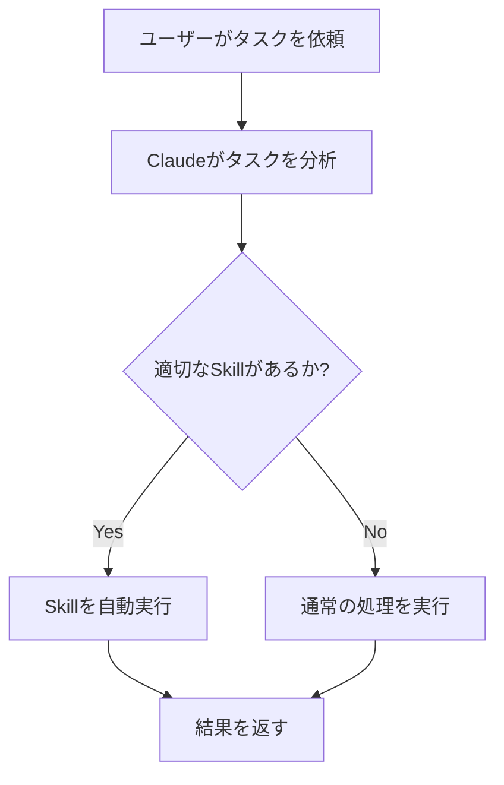

# Skills（スキル）基礎ガイド

## 目次
- [Skillsとは](#skillsとは)
- [スラッシュコマンドとの違い](#スラッシュコマンドとの違い)
- [Skillsの仕組み](#skillsの仕組み)
- [Skillsの配置場所](#skillsの配置場所)
- [既存Skillsの使用方法](#既存skillsの使用方法)
- [SKILL.mdファイルの構造](#skillmdファイルの構造)
- [効果的な説明の書き方](#効果的な説明の書き方)
- [Skillsの有効化と無効化](#skillsの有効化と無効化)
- [ツール制限の設定](#ツール制限の設定)
- [トラブルシューティング](#トラブルシューティング)
- [ベストプラクティス](#ベストプラクティス)

---

## Skillsとは

**Skills（スキル）** は、Claude Codeに特定の専門知識や複雑なワークフローを実行する能力を与える、再利用可能な自動化モジュールです。

### 主な特徴

- **自律的な起動**: Claudeがタスクに応じて自動的に適切なSkillを選択・実行
- **複雑なワークフロー対応**: 複数ステップの処理を1つのSkillにまとめられる
- **専門知識の提供**: 特定ドメインの深い知識をClaudeに与える
- **再利用可能**: 一度定義すれば何度でも自動的に利用される

### 使用例

- **PDFドキュメントの処理**: PDFファイルの読み取り、変換、解析
- **Excelファイルの操作**: スプレッドシートの読み書き、データ分析
- **コードレビュー**: プログラミング言語固有の詳細なレビュー
- **データ分析**: 統計処理やビジュアライゼーション
- **デプロイメント**: 複雑なデプロイフローの自動化

---

## スラッシュコマンドとの違い

Skillsとスラッシュコマンドは似ていますが、**起動方法**と**用途**が異なります。

### 比較表

| 項目 | Skills | スラッシュコマンド |
|------|--------|-------------------|
| **起動方法** | Claudeが自動的に判断して実行 | ユーザーが明示的に `/command` で呼び出す |
| **適した用途** | 複雑な多段階ワークフロー | シンプルな定型タスク |
| **設定ファイル** | `SKILL.md` (YAMLフロントマター必須) | `.md` ファイル (フロントマター任意) |
| **配置場所** | `.claude/skills/` または `~/.claude/skills/` | `.claude/commands/` |
| **ユーザー意識** | 透過的（自動実行） | 明示的（手動実行） |
| **複雑度** | 複数ステップ、条件分岐可能 | 単一プロンプト、シンプル |

### 使い分けのガイドライン

**Skillsを使うべき場合:**
- Claudeに自動的に判断してほしい
- 複数のステップやツール呼び出しが必要
- 特定の専門知識が必要
- 条件によって処理を分岐する

**スラッシュコマンドを使うべき場合:**
- ユーザーが明示的に実行したい
- シンプルで直線的なタスク
- 毎回同じ処理を行う
- 頻繁に使う定型業務

---

## Skillsの仕組み

### 自動起動プロセス



1. **タスク分析**: ユーザーの依頼内容を解析
2. **Skill検索**: 利用可能なSkillsの中から最適なものを探す
3. **マッチング**: Skillの`description`とタスク内容を比較
4. **自動実行**: 条件が合えば自動的にSkillを起動
5. **結果返却**: Skillの実行結果をユーザーに報告

### ⚠️ 重要なポイント

- Claudeは複数のSkillsを組み合わせて使用することもある
- 適切なSkillが見つからない場合は通常の処理を行う
- Skillの説明文が起動の鍵となる（詳細は[効果的な説明の書き方](#効果的な説明の書き方)）

---

## Skillsの配置場所

Skillsは2つの場所に配置できます。

### 1. 個人用Skills（グローバル）

```
~/.claude/skills/
├── my-skill/
│   ├── SKILL.md          # 必須：Skill定義ファイル
│   ├── helper.py         # 任意：補助スクリプト
│   └── template.txt      # 任意：テンプレート
└── another-skill/
    └── SKILL.md
```

**場所**: `~/.claude/skills/`

**特徴**:
- すべてのプロジェクトで利用可能
- 個人的なワークフロー向け
- チームとは共有されない

**使用例**:
- 個人の開発環境設定
- よく使う分析手法
- 個人的な文書フォーマット

### 2. プロジェクトSkills（ローカル）

```
project-root/
├── .claude/
│   └── skills/
│       ├── code-review/
│       │   ├── SKILL.md
│       │   └── rules.json
│       └── deployment/
│           └── SKILL.md
└── src/
```

**場所**: `<プロジェクトルート>/.claude/skills/`

**特徴**:
- 特定のプロジェクトでのみ利用可能
- チームメンバーと共有可能（Gitにコミット）
- プロジェクト固有のワークフロー向け

**使用例**:
- プロジェクト固有のコードレビュールール
- カスタムビルド・デプロイ手順
- プロジェクト特有のテスト戦略

### ディレクトリ構造のルール

- 各Skillは**独自のディレクトリ**を持つ
- ディレクトリ名が**Skill名**になる（例: `code-review`）
- **`SKILL.md`** ファイルは必須
- 補助ファイル（スクリプト、設定、テンプレート等）は任意で追加可能

---

## 既存Skillsの使用方法

### 1. 利用可能なSkillsの確認

Claude Codeで利用可能なSkillsを確認する方法:

```bash
# コマンドラインから確認（将来実装予定）
claude skills list

# または、Claudeに直接質問
"利用可能なSkillsを教えてください"
```

### 2. Skillsの自動利用

Skillsは**自動的に起動**するため、特別な操作は不要です。

**例: PDFファイルを処理したい場合**

```
ユーザー: "このPDFファイルの内容を要約してください: report.pdf"

↓ Claudeが自動的に判断

Claude: PDFスキルを使用してファイルを読み取ります...
```

### 3. 明示的なSkill指定（上級）

特定のSkillを明示的に使いたい場合は、Skillの目的に沿った表現を使います。

**良い例:**
```
"Excelファイルを読み取って分析してください"
→ Excel Skillが自動起動

"PDFドキュメントから表を抽出してください"
→ PDF Skillが自動起動
```

**⚠️ 注意:**
スラッシュコマンドのように `/skill-name` という形式では呼び出せません。
Skillsはあくまで**自然な会話の中で自動起動**します。

---

## SKILL.mdファイルの構造

Skillを定義するには、`SKILL.md`ファイルを作成します。

### 基本的な構造

```markdown
---
name: skill-name
description: Skillが何をするか、いつ使うべきかの簡潔な説明
allowed-tools:
  - tool1
  - tool2
---

# Skillの詳細な指示

ここにClaudeが従うべき詳細な指示を記述します。

## 実行手順

1. 最初のステップ
2. 次のステップ
3. 最終ステップ

## 注意事項

- 重要なポイント
- 制約事項
```

### YAMLフロントマター（必須）

ファイルの先頭に `---` で囲まれたYAMLセクションを配置:

#### `name` (必須)

Skillの一意な識別名。小文字とハイフンのみ使用。

```yaml
name: pdf-analyzer
```

#### `description` (必須)

Skillの目的と使用タイミングを説明する文。**最も重要な項目**。

```yaml
description: PDFドキュメントの読み取り、解析、要約を行います。PDFファイルの処理が必要な場合に使用してください。
```

#### `allowed-tools` (任意)

Skillが使用できるツールを制限（詳細は[ツール制限の設定](#ツール制限の設定)）。

```yaml
allowed-tools:
  - Read
  - Bash
  - WebFetch
```

### 指示セクション（本文）

フロントマターの後に、Claudeへの詳細な指示を記述:

```markdown
# PDF解析Skill

このSkillはPDFファイルを処理します。

## 処理手順

1. ファイルの存在を確認
2. PDFツールで内容を抽出
3. 構造化されたデータに変換
4. ユーザーの要求に応じて処理（要約、検索等）

## 出力形式

- 明確な見出しを使用
- 重要な情報を強調
- 元のページ番号を参照
```

---

## 効果的な説明の書き方

Skillの`description`は、Claudeが**いつそのSkillを使うべきか判断する**ための最重要要素です。

### 良い説明の条件

1. **何をするか**を明確に記述
2. **いつ使うべきか**を具体的に示す
3. **トリガー用語**を含める（ユーザーが使いそうな言葉）
4. 簡潔で分かりやすい（1-2文）

### 良い例 ✅

```yaml
description: Excelスプレッドシートの読み取り、データ分析、グラフ生成を行います。.xlsxまたは.xlsファイルの処理が必要な場合に使用してください。
```

**なぜ良いか:**
- 具体的な機能（読み取り、分析、グラフ生成）
- 明確なトリガー（.xlsx、.xlsファイル）
- ユーザーが使う言葉（「Excelスプレッドシート」）

```yaml
description: GitHubプルリクエストの詳細なコードレビューを実施します。変更の品質チェック、セキュリティ検証、ベストプラクティスの確認が必要な場合に使用してください。
```

**なぜ良いか:**
- 具体的なユースケース（PRレビュー）
- 複数の処理内容（品質、セキュリティ、ベストプラクティス）
- 明確な使用条件

### 悪い例 ❌

```yaml
description: 便利なツール
```

**なぜ悪いか:**
- 何をするか不明確
- いつ使うべきか不明
- トリガー用語がない

```yaml
description: ファイル処理
```

**なぜ悪いか:**
- 曖昧すぎる（どんなファイル？何の処理？）
- 使用条件が不明

```yaml
description: このSkillはプロジェクトの様々なファイルを読み取り、解析し、変換し、最適化し、レポートを生成し、通知を送信します。
```

**なぜ悪いか:**
- 長すぎて焦点がぼやける
- 複数の異なる機能が混在（分割すべき）

### トリガー用語の含め方

ユーザーが使いそうな**キーワード**を説明に含める:

**例: PDF処理Skill**
```yaml
description: PDFドキュメントの読み取り、テキスト抽出、表の解析を行います。PDF、.pdfファイルの処理時に使用してください。
```

トリガー用語: `PDF`, `PDFドキュメント`, `.pdf`, `読み取り`, `抽出`, `解析`

**例: デプロイSkill**
```yaml
description: アプリケーションをVercelにデプロイします。本番環境へのリリース、デプロイ、公開が必要な場合に使用してください。
```

トリガー用語: `デプロイ`, `Vercel`, `本番環境`, `リリース`, `公開`

---

## Skillsの有効化と無効化

### デフォルトの状態

- 配置されたすべてのSkillsは**自動的に有効**
- Claudeは必要に応じて自動的に使用

### 一時的な無効化

特定のセッションでSkillを使いたくない場合は、Claudeに指示:

```
"今回はSkillsを使わずに処理してください"
```

### 永続的な無効化

Skillを完全に無効化するには、以下の方法があります:

#### 方法1: ディレクトリ名の変更

```bash
# Skillディレクトリ名の先頭に "_" を追加
mv ~/.claude/skills/my-skill ~/.claude/skills/_my-skill
```

#### 方法2: ファイル削除または移動

```bash
# 一時的に別の場所に移動
mv ~/.claude/skills/my-skill ~/backup/my-skill

# または完全に削除
rm -rf ~/.claude/skills/my-skill
```

#### 方法3: 設定ファイルでの制御（将来実装予定）

```yaml
# ~/.claude/config.yml (将来のバージョン)
skills:
  disabled:
    - my-skill
    - another-skill
```

---

## ツール制限の設定

Skillが使用できるツールを制限することで、**安全性**と**予測可能性**を向上させます。

### allowed-toolsの指定

```yaml
---
name: safe-analyzer
description: 読み取り専用のコード分析を行います
allowed-tools:
  - Read
  - Grep
  - Glob
---
```

### 利用可能な主なツール

| ツール名 | 機能 |
|---------|------|
| `Read` | ファイル読み取り |
| `Write` | ファイル書き込み |
| `Edit` | ファイル編集 |
| `Bash` | コマンド実行 |
| `Grep` | テキスト検索 |
| `Glob` | ファイル検索 |
| `WebFetch` | Web コンテンツ取得 |
| `WebSearch` | Web 検索 |

### ⚠️ 制限しない場合

`allowed-tools`を指定しない場合、Skillは**すべてのツールを使用可能**になります。

```yaml
---
name: unrestricted-skill
description: すべてのツールにアクセス可能なSkill
# allowed-tools を指定しない = すべて許可
---
```

### セキュリティのベストプラクティス

**読み取り専用Skill:**
```yaml
allowed-tools:
  - Read
  - Grep
  - Glob
```

**分析・レポートSkill:**
```yaml
allowed-tools:
  - Read
  - Grep
  - WebFetch
```

**自動化・デプロイSkill:**
```yaml
allowed-tools:
  - Read
  - Write
  - Edit
  - Bash
```

---

## トラブルシューティング

### Skillが起動しない

#### 原因1: 説明が不適切

**解決策**: `description`を見直す

```yaml
# 改善前
description: ツール

# 改善後
description: PDFファイルの読み取りと解析を行います。PDFドキュメントの処理時に使用してください。
```

#### 原因2: SKILL.mdの構文エラー

**解決策**: YAMLフロントマターの形式を確認

```markdown
---
name: my-skill
description: 説明文
---

本文
```

- フロントマターは `---` で**必ず囲む**
- インデントは**スペース2つ**
- `name`と`description`は**必須**

#### 原因3: ファイル配置ミス

**解決策**: 正しいディレクトリ構造を確認

```
✅ 正しい:
~/.claude/skills/my-skill/SKILL.md

❌ 間違い:
~/.claude/skills/SKILL.md
~/.claude/my-skill/SKILL.md
```

### Skillが期待通りに動作しない

#### デバッグ方法

1. **Claudeに質問する**:
   ```
   "どのSkillを使用しましたか？"
   "なぜそのSkillを選びましたか？"
   ```

2. **説明文を改善する**:
   より具体的なトリガー用語を追加

3. **指示を明確にする**:
   SKILL.md本文の手順を詳細に記述

### 複数のSkillが競合する

似たような説明を持つSkillsがある場合、Claudeが混乱する可能性があります。

**解決策**:
- 各Skillの役割を明確に分離
- `description`でユースケースを明確に区別

```yaml
# PDF読み取り専用
---
name: pdf-reader
description: PDFファイルからテキストを抽出します。単純な読み取りが必要な場合に使用してください。
---

# PDF分析用（より高度）
---
name: pdf-analyzer
description: PDFドキュメントの詳細な分析、表の抽出、構造解析を行います。複雑なPDF処理が必要な場合に使用してください。
---
```

---

## ベストプラクティス

### 1. Skillは単一責任にする

各Skillは**1つの明確な目的**を持つべきです。

✅ **良い例:**
- `pdf-reader`: PDF読み取り専用
- `excel-analyzer`: Excel分析専用
- `code-reviewer`: コードレビュー専用

❌ **悪い例:**
- `file-processor`: PDFもExcelもWordも処理（役割が広すぎる）

### 2. 分かりやすい名前を付ける

Skill名は**機能を表す明確な名前**にします。

✅ **良い例:**
- `github-pr-reviewer`
- `vercel-deployer`
- `test-coverage-analyzer`

❌ **悪い例:**
- `helper`
- `tool1`
- `my-script`

### 3. 詳細な指示を書く

SKILL.md本文には、Claudeが従うべき**詳細な手順**を記述します。

```markdown
---
name: code-reviewer
description: プルリクエストの詳細なコードレビューを実施します
---

# コードレビューSkill

## レビュー手順

1. 変更されたファイルを特定
2. 各ファイルについて以下を確認:
   - コーディング規約の遵守
   - バグや脆弱性の有無
   - テストの充実度
   - パフォーマンスへの影響
3. 改善提案をまとめて報告

## 評価基準

### 必須チェック項目
- [ ] 型安全性
- [ ] エラーハンドリング
- [ ] セキュリティリスク

### 推奨チェック項目
- [ ] パフォーマンス最適化
- [ ] コメントの適切性
- [ ] テストカバレッジ

## 出力形式

### 良い点
- [箇条書きでリスト]

### 改善点
- [具体的な改善提案]

### 重要度: 高 / 中 / 低
```

### 4. テストと反復改善

Skillを作成したら、実際に使ってみて改善します。

**テスト手順:**

1. Skillを配置
2. 実際のタスクで使ってみる
3. Claudeに質問:
   ```
   "どのSkillを使いましたか？"
   "期待通りに動作しましたか？"
   ```
4. 必要に応じて`description`や指示を修正
5. 再テスト

### 5. チームでの共有

プロジェクトSkillsをGitにコミットしてチーム全体で活用:

```bash
# プロジェクトSkillsをバージョン管理
git add .claude/skills/
git commit -m "Add code review skill for this project"
git push
```

**チームメンバーへの周知:**
- READMEにSkillsの説明を追加
- Skillsの使い方をドキュメント化
- 定期的にSkillsをレビュー・改善

### 6. ドキュメントを保守する

Skillsが増えてきたら、一覧を管理:

```markdown
# .claude/skills/README.md

## 利用可能なSkills

### code-reviewer
プルリクエストの詳細レビューを実施します。
使用例: "このPRをレビューしてください"

### vercel-deployer
Vercelへのデプロイを自動化します。
使用例: "本番環境にデプロイしてください"

### test-analyzer
テストカバレッジを分析し、改善提案を行います。
使用例: "テストカバレッジを確認してください"
```

---

## まとめ

### Skillsの重要なポイント

✅ Skillsは**自動起動**する（ユーザーが明示的に呼び出す必要なし）
✅ **description**が最も重要（Claudeの判断基準）
✅ **単一責任**の原則で設計する
✅ **詳細な指示**を書く
✅ **allowed-tools**で安全性を確保

### 次のステップ

1. [Skills実践ガイド](./05-skills-advanced.md)で高度な使い方を学ぶ
2. [公開Skillsギャラリー](./06-skills-gallery.md)で既存Skillsを探す
3. [カスタムSkills作成](./07-creating-skills.md)で独自Skillsを開発

---

## 関連ドキュメント

- [スラッシュコマンド基礎](../03-core-features/06-slash-commands-basics.md)
- [スラッシュコマンド実践](../03-core-features/07-slash-commands-advanced.md)
- [MCPサーバー入門](./01-mcp-introduction.md)
- [エコシステム概要](./README.md)

---

#初心者 #Skills #エコシステム #自動化 #ワークフロー #拡張機能
