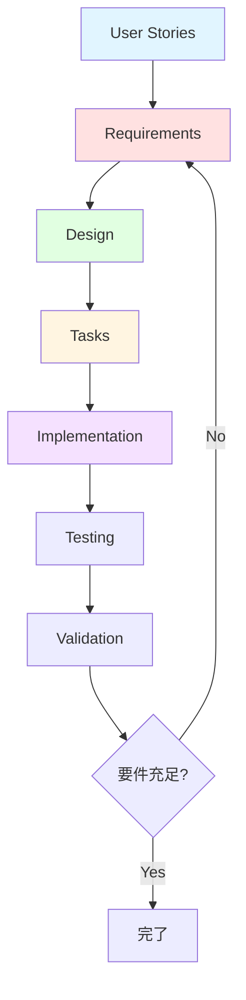
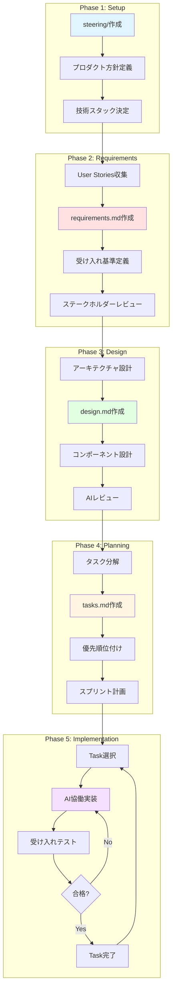

# スペック駆動開発（Spec-Driven Development）

Claude Codeを最大限活用した要件駆動の体系的開発手法について説明します。.kiroシステムを使用した仕様管理とAIとの協働による、高品質で保守性の高いソフトウェア開発の実現方法を学習できます。

## スペック駆動開発とは

### 概要

スペック駆動開発は、プロジェクトの仕様（Requirements、Design、Tasks）を明文化し、それを基にAIと協働して開発を進める手法です。従来のドキュメント駆動開発をAI時代に最適化したアプローチといえます。

### 核となる思想



**3つの柱:**

1. **トレーサビリティ**: User Storyから実装まで一貫した追跡
2. **受け入れ基準の明確化**: WHEN/THEN形式による検証可能な要件
3. **AI協働最適化**: 明文化された仕様によるAIとの効果的な対話

### 従来手法との違い

| 観点 | 従来のアジャイル | スペック駆動開発 |
|------|-----------------|-----------------|
| 仕様管理 | 口頭・チケット中心 | 構造化された.kiroディレクトリ |
| AI活用 | 部分的・試行錯誤 | 仕様ベースの体系的活用 |
| トレーサビリティ | 限定的 | User Story→Tasks完全追跡 |
| 品質保証 | テスト後に確認 | 受け入れ基準で事前定義 |
| 保守性 | ドキュメント陳腐化 | コードと仕様の同期維持 |

## .kiroシステムの概要

### ディレクトリ構造

```
.kiro/
├── steering/          # AI指導ルール（プロジェクト設計思想）
│   ├── product.md     # プロダクト概要・目的・対象ユーザー
│   ├── structure.md   # プロジェクト構造・組織化原則
│   └── tech.md        # 技術スタック・ビルドシステム
│
└── specs/             # プロジェクト仕様（要件駆動設計）
    └── [project-name]/
        ├── requirements.md  # User Storiesと受け入れ基準
        ├── design.md        # アーキテクチャと設計詳細
        └── tasks.md         # 実装タスクリスト
```

### steering vs specs

| ディレクトリ | 目的 | 更新頻度 | AIへの影響 |
|------------|------|---------|-----------|
| **steering/** | プロジェクトの設計思想・原則を定義 | 低（確立後は安定） | AIの判断基準・コーディング規約として機能 |
| **specs/** | 具体的な機能・実装仕様を管理 | 高（開発に応じて進化） | AI実装の直接的な指示として機能 |

**steering/**の例:
- 「このプロジェクトは初心者向け学習リソースである」
- 「ファイル名はkebab-caseを使用する」
- 「React 18 + TypeScriptで開発する」

**specs/**の例:
- 「ユーザー管理機能のCRUD操作を実装する」
- 「認証はJWT方式を採用する」
- 「Task #5: ログイン画面コンポーネント作成」

## 設計思想

### 1. Requirements（要件定義）

**目的:** User Storiesと受け入れ基準の明文化

```markdown
### Requirement N

**User Story:** [役割]として、[目的]したいので、[機能]が欲しい

#### Acceptance Criteria

1. WHEN [条件] THEN [期待結果]
2. WHEN [条件] THEN [期待結果]
3. IF [特殊条件] THEN [期待結果]
```

**特徴:**
- 検証可能な形式（WHEN/THEN/IF）
- ステークホルダー視点の記述
- 機能の「なぜ」を明確化

### 2. Design（設計）

**目的:** アーキテクチャと実装詳細の設計

```markdown
## Architecture
- システム構造図
- コンポーネント設計
- データフロー

## Components and Interfaces
- 各コンポーネントの責務
- API設計
- インターフェース定義

## Data Models
- データ構造
- 永続化方式

## Error Handling
- エラー処理戦略

## Testing Strategy
- テストアプローチ
```

**特徴:**
- Requirementsからの自然な導出
- 技術選択の根拠記録
- 実装者が迷わない詳細度

### 3. Tasks（タスク管理）

**目的:** 実装タスクの優先順位付けと進捗管理

```markdown
- [x] 1. Task Title
  - サブタスク詳細
  - _Requirements: 1.1, 2.3_

- [ ] 2. Next Task
  - 依存関係の明記
  - _Requirements: 3.1_
```

**特徴:**
- Requirementsへの明示的な紐付け
- 完了条件の明確化
- 依存関係の可視化

## スペック駆動開発の利点

### 1. AI協働の効率化

**Before（スペックなし）:**
```
開発者: "ユーザー管理機能を作って"
AI: "どのような機能ですか？CRUDは全部必要？認証は？"
開発者: "えーと、登録と削除だけで..."
AI: "わかりました。データ構造は？"
開発者: "名前とメールで..."
```
→ 何度も質問と回答のやり取りが必要

**After（スペックあり）:**
```
開発者: ".kiro/specs/app/requirements.md を見て、Requirement 3のユーザー管理機能を実装して"
AI: [仕様を読み込み] "了解しました。requirements.mdの受け入れ基準に基づき、design.mdの設計に従って実装します"
```
→ 一度の指示で正確な実装が可能

### 2. 品質の向上

- **受け入れ基準による明確な成功定義**
  - 実装前に何を作るべきか全員が理解
  - テスト設計が自然に導出される

- **設計の一貫性**
  - design.mdによる統一されたアーキテクチャ
  - 技術的負債の予防

- **トレーサビリティ**
  - User Story → Requirement → Design → Task → Code
  - なぜこのコードが存在するのか追跡可能

### 3. チーム開発の円滑化

- **共通理解の形成**
  - 仕様が単一の真実の情報源（Single Source of Truth）
  - 新メンバーのオンボーディング効率化

- **レビューの効率化**
  - 受け入れ基準に対する検証が明確
  - 設計意図の共有が容易

### 4. 保守性の向上

- **ドキュメントとコードの同期**
  - 仕様変更時にdocs更新が自然な流れ
  - 陳腐化しにくい

- **変更影響分析の容易化**
  - Requirements紐付けによる影響範囲把握
  - 安全なリファクタリング

## スペック駆動開発のワークフロー

### 全体フロー



### プロジェクト規模別の適用

#### 小規模プロジェクト（1-2人、1-3ヶ月）

```
最小構成:
.kiro/
├── steering/
│   └── product.md     # 簡易版でOK
└── specs/
    └── main/
        ├── requirements.md  # 5-10個のUser Stories
        └── tasks.md         # design.mdは省略可
```

**ポイント:**
- design.mdは簡易的でOK（または省略）
- User Storiesを中心に進行
- AIとの対話で設計を補完

#### 中規模プロジェクト（3-10人、3-12ヶ月）

```
標準構成:
.kiro/
├── steering/
│   ├── product.md
│   ├── structure.md
│   └── tech.md
└── specs/
    ├── frontend/
    │   ├── requirements.md
    │   ├── design.md
    │   └── tasks.md
    └── backend/
        ├── requirements.md
        ├── design.md
        └── tasks.md
```

**ポイント:**
- コンポーネントごとにspecs/分割
- design.mdでアーキテクチャ明確化
- チーム間の仕様共有が重要

#### 大規模プロジェクト（10人以上、12ヶ月以上）

```
完全構成:
.kiro/
├── steering/
│   ├── product.md
│   ├── structure.md
│   ├── tech.md
│   └── quality.md      # 品質基準追加
└── specs/
    ├── core/
    ├── feature-a/
    ├── feature-b/
    └── integration/
        ├── requirements.md
        ├── design.md
        ├── tasks.md
        └── testing.md   # テスト戦略追加
```

**ポイント:**
- 機能単位での完全な仕様管理
- 統合仕様の明確化
- 品質基準とテスト戦略の文書化

## 学習パス

### 基礎編（所要時間: 2-3時間）

1. **[.kiroの基礎](01-steering-basics.md)** - 15分
   - .kiroシステムの概念理解
   - steering/とspecs/の役割
   - 基本的なファイル構造

2. **[requirements.md作成](02-requirements-spec.md)** - 45分
   - User Storyの書き方
   - 受け入れ基準の定義方法
   - WHEN/THEN/IF形式の実践

3. **[design.md作成](03-design-spec.md)** - 60分
   - アーキテクチャ設計の記述
   - コンポーネント設計の詳細化
   - AIレビューの活用

4. **[tasks.md活用](04-tasks-spec.md)** - 30分
   - タスク分解のテクニック
   - Requirements紐付けの方法
   - 進捗管理のベストプラクティス

### 実践編（所要時間: 3-4時間）

5. **[AIとの協働ワークフロー](05-ai-workflow.md)** - 90分
   - スペックを使ったAIプロンプト
   - 実装からテストまでの完全フロー
   - トラブルシューティング

6. **実践演習: Todoアプリ開発** - 120分
   - .kiroシステムのセットアップ
   - requirements.md作成
   - AIと協働で実装
   - 受け入れテスト実施

### 高度編（所要時間: 2-3時間）

7. **チーム開発での.kiro活用**
   - 複数プロジェクトの管理
   - チーム間の仕様共有
   - レビュープロセスの最適化

8. **大規模プロジェクトのベストプラクティス**
   - specs/の分割戦略
   - 統合仕様の管理
   - 継続的な仕様メンテナンス

## 実践例: このリポジトリ自体

⚠️ **重要:** このリポジトリ自体がスペック駆動開発で作られています！

### .kiroの実例

```bash
# このリポジトリの.kiroを見てみましょう
ls -la .kiro/

# steering（設計思想）
cat .kiro/steering/product.md    # プロダクト概要を確認
cat .kiro/steering/structure.md  # ディレクトリ構造を確認
cat .kiro/steering/tech.md       # 技術スタックを確認

# specs（仕様）
cat .kiro/specs/claude-code-documentation/requirements.md
cat .kiro/specs/claude-code-documentation/design.md
cat .kiro/specs/claude-code-documentation/tasks.md
```

### 具体的な効果

**このリポジトリでの成果:**
- 📚 200+ページのドキュメントを体系的に構築
- 🎯 6つのUser Storiesから72のタスクへの完全なトレーサビリティ
- 🤖 AIとの協働により短期間で高品質を実現
- 🔄 仕様変更時も影響範囲を正確に把握

## ベストプラクティス

### 1. requirements.md作成のコツ

✅ **Good:**
```markdown
### Requirement 1

**User Story:** 開発者として、コード生成機能を理解したいので、実例付きドキュメントが欲しい

#### Acceptance Criteria

1. WHEN ユーザーがドキュメントを開いた時 THEN 5つ以上のコード生成例が表示される
2. WHEN ユーザーが例を実行した時 THEN 期待される出力が得られる
3. IF ユーザーがエラーに遭遇した時 THEN トラブルシューティングガイドへのリンクが提供される
```

❌ **Bad:**
```markdown
### Requirement 1
コード生成のドキュメントを書く
```

### 2. design.md作成のコツ

✅ **Good:**
```markdown
## Architecture

### Component Structure
- UserForm: ユーザー入力を受け付け、バリデーション実施
- UserList: ユーザーデータを一覧表示、検索・フィルタリング対応
- UserService: CRUD操作の実装、LocalStorageへの永続化

### Data Flow
1. UserForm → validation → UserService.create()
2. UserService → LocalStorage → state update
3. state update → UserList re-render
```

❌ **Bad:**
```markdown
## Architecture
Reactでコンポーネント作って、データはLocalStorageに保存
```

### 3. tasks.md作成のコツ

✅ **Good:**
```markdown
- [x] 1. ユーザーフォームコンポーネント作成
  - バリデーションロジック実装（email形式、必須フィールド）
  - エラーメッセージ表示機能
  - _Requirements: 1.1, 1.2_
  - _Dependencies: なし_

- [ ] 2. ユーザーリストコンポーネント作成
  - _Requirements: 2.1, 2.3_
  - _Dependencies: Task 1（UserServiceが必要）_
```

❌ **Bad:**
```markdown
- [ ] フォーム作る
- [ ] リスト作る
```

### 4. steeringファイル作成のコツ

✅ **Good:**
```markdown
# product.md

## 対象ユーザー
- **初心者**: AIツールが初めての開発者
- **中級者**: 効率化手法を求める実務者

## 核となる目的
- 段階的学習パスの提供
- 実践的なコード例の提示
```

❌ **Bad:**
```markdown
# product.md
いい感じのドキュメントを作る
```

### 5. AIプロンプトのコツ

✅ **Good:**
```
.kiro/specs/app/requirements.mdのRequirement 3「ユーザー検索機能」を実装してください。

design.mdのSection 2.3に記載されたSearchBarコンポーネントの設計に従い、以下を実装：
1. リアルタイム検索
2. 大文字小文字を区別しない
3. 名前とメールアドレスの両方を検索対象とする

tasks.mdのTask 5として記録してください。
```

❌ **Bad:**
```
検索機能作って
```

## よくある質問

### Q1: すべてのプロジェクトで.kiroを使うべき？

**A:** プロジェクト規模と期間によります：

- **使うべき:** 2週間以上、2人以上、または将来的な拡張予定がある
- **オプション:** 1週間以内の小規模実験、個人の学習プロジェクト
- **簡易版でOK:** スクリプトやツール開発（product.mdとtasks.mdのみ）

### Q2: 既存プロジェクトに導入できる？

**A:** 可能です。段階的アプローチを推奨：

1. **Week 1:** steering/product.mdとtech.mdを作成（現状を記録）
2. **Week 2:** 次の機能追加時にrequirements.mdを作成
3. **Week 3:** design.mdで設計を明文化開始
4. **Week 4:** 既存機能のrequirementsも遡って記録

### Q3: 仕様が変わったらどうする？

**A:** .kiroは生きたドキュメントです：

1. requirements.md更新（User Story追加・修正）
2. design.md更新（影響範囲を反映）
3. tasks.md更新（新タスク追加、完了タスクは保持）
4. git commitで変更履歴を記録

### Q4: AIが仕様を無視する場合は？

**A:** プロンプトの改善とチェック体制：

```
# より明確なプロンプト
.kiro/specs/app/requirements.md Requirement 3の受け入れ基準1-3をすべて満たす実装をしてください。
実装後、以下をチェック：
□ AC1: [具体的な基準]
□ AC2: [具体的な基準]
□ AC3: [具体的な基準]
```

### Q5: design.mdはどこまで詳細に書く？

**A:** 実装者が迷わない程度が目安：

- **必須:** アーキテクチャ概要、主要コンポーネント、データフロー
- **推奨:** API設計、データモデル、エラーハンドリング
- **オプション:** 詳細なアルゴリズム（複雑な場合のみ）

## 関連ドキュメント

### 前提知識
- [AIと要件定義](../06-development-process/01-requirements-with-ai.md) - 要件定義の基礎
- [AIと設計](../06-development-process/02-design-with-ai.md) - 設計プロセスの理解
- [設計原則とCLAUDE.md](../06-development-process/03-design-principles.md) - 設計原則管理

### 関連トピック
- [チーム開発](../07-team-development/README.md) - チーム規模での活用
- [大規模開発テクニック](../07-team-development/05-large-scale-techniques.md) - 大規模プロジェクト管理
- [品質保証](../06-development-process/06-unit-testing.md) - テスト戦略

### 実践例
- [サンプルアプリ](../08-examples/simple-webapp/README.md) - 実装例
- [このリポジトリの.kiro](../../.kiro/) - 実際のスペック管理

## 次のステップ

スペック駆動開発の概要を理解したら、具体的な実践に進みましょう：

### 今すぐ始められる
1. **[.kiroの基礎](01-steering-basics.md)** - システムの理解（15分）
2. **[requirements.md作成](02-requirements-spec.md)** - 最初の仕様作成（45分）

### 段階的に習得
1. **[design.md作成](03-design-spec.md)** - 設計の文書化（60分）
2. **[tasks.md活用](04-tasks-spec.md)** - タスク管理の最適化（30分）

### 実践で学ぶ
1. **[AIとの協働ワークフロー](05-ai-workflow.md)** - 完全なフローの習得（90分）
2. **実践演習** - 自分のプロジェクトで試す（2-3時間）

---

**ナビゲーション:**
- ⬅️ 前へ: [開発プロセス](../06-development-process/README.md) - AI活用開発の基礎
- ➡️ 次へ: [.kiroの基礎](01-steering-basics.md) - システムの詳細理解

**メタ情報:**
- 更新日: 2024-11-25
- 難易度: 中級
- 推定学習時間: 基礎編 2-3時間、実践編 3-4時間
- タグ: `#中級者` `#スペック駆動開発` `#.kiro` `#要件管理` `#AI協働` `#品質管理`
